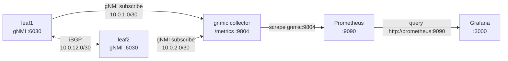

# Lab 50 — gnmic + Prometheus + Grafana Stack

> **Format:** Hands-on. Deploy the full streaming-telemetry observability stack inside containerlab: 2 switches → gnmic collector → Prometheus → Grafana. Reference config in [`solutions/`](solutions/) (used directly by topology).
>
> **Story chapter:** Phase 9 · Tech lead · Year 5+. Lab 49 proved gNMI works. Now you build the production-shape stack: telemetry collector, time-series database, dashboards. Other teams will ask for read access — this is the team's source of operational truth. See [`STORY.md`](../../STORY.md).

## Real-world scenario

You have streaming telemetry available (lab 49). Now you need to turn it into operational signal:

1. **Collector** subscribes to all the relevant paths on every device. Aggregates into a uniform metric format.
2. **Time-series database** (Prometheus / InfluxDB / TimescaleDB) stores the metrics with retention policies.
3. **Visualization** (Grafana) shows it. NOC views, capacity views, customer-impact dashboards.
4. **Alerting** triggers on conditions (BGP session down > 60s, interface utilization > 80%, CPU > 90% sustained).

The reference stack: gnmic + Prometheus + Grafana. Open-source, well-understood, runs anywhere.

## Goal

- Deploy gnmic configured to subscribe to both leaves and expose metrics on `/metrics`
- Deploy Prometheus configured to scrape gnmic
- Deploy Grafana with Prometheus as a datasource
- Verify metrics flow end-to-end
- Build a dashboard panel

## Topology



Data flow / addressing:
- The collector reaches **each leaf over its own `/30` point-to-point link** (containerlab links are independent L2 segments, so one shared subnet across two links would only reach whichever link owns the route). leaf1 lives on `10.0.1.0/30`, leaf2 on `10.0.2.0/30`.
- The two leaves run a small **iBGP** session over `10.0.12.0/30` purely so the BGP telemetry path has live data (see Theory primer).
- **Prometheus → gnmic** (scrape) and **Grafana → Prometheus** (query) both use the containerlab **management network + Docker DNS** (`gnmic:9804`, `http://prometheus:9090`), so they need no data links.

Ports exposed on the lab VM:
- Prometheus: http://localhost:9090
- Grafana: http://localhost:3000 (admin / admin)

> The gnmic collector's `:9804` Prometheus endpoint is **not** published to the VM — it lives only inside the gnmic container (that is why the verification below reaches it via `docker exec`, not `curl` from the VM). Only Prometheus `:9090` and Grafana `:3000` are mapped to the host.

## Theory primer

### Why this exact stack

- **gnmic**: vendor-neutral gNMI client maintained by OpenConfig. Built-in Prometheus exporter. Config-driven (one YAML file).
- **Prometheus**: pull-based. Scrapes gnmic's `/metrics`. Built-in alerting (Alertmanager).
- **Grafana**: best-in-class viz, native Prom datasource.

Alternatives:
- **InfluxDB** instead of Prom (push-based; better at high cardinality).
- **VictoriaMetrics** (Prom-compatible, much more efficient at scale).
- **Telegraf** as the collector (broader input support, less gNMI-native).

For a regional cloud-provider scale (hundreds of devices), this stack is fine. At hyperscaler scale, you swap Prom for VictoriaMetrics or Mimir.

### Metric naming convention

gnmic Prom output translates YANG paths to metric names: each `/`-separated YANG
element becomes an underscore-separated segment, prefixed with the configured
`metric-prefix` (`gnmic_` here). So the OpenConfig path
`/interfaces/interface/state/counters/in-octets` becomes:
- `gnmic_interfaces_interface_state_counters_in_octets`

> **Discover the real name first.** gnmic's exact output depends on the YANG
> origin/path the device returns, so before writing PromQL, browse the live
> metric list and confirm the name rather than trusting this README blindly:
> ```bash
> docker exec clab-gnmic-prom-grafana-gnmic wget -qO- http://localhost:9804/metrics | grep -i octets
> ```
> (or use Prometheus' metric autocomplete in the Graph tab). If your build
> prepends an origin token, adjust the queries below to match.

Add labels for `source` (device name), `interface_name`, etc. You query with PromQL:

```promql
# Top 10 most-used interfaces over the last 5 minutes
topk(10, rate(gnmic_interfaces_interface_state_counters_in_octets[5m]) * 8 / 1e9)
```

### Alerting rules to start with

The two leaves run a live iBGP session (AS 65000, over `10.0.12.0/30`), so the
BGP neighbor-state subscription in `gnmic.yaml` produces real telemetry you can
alert on. The other rows below are the patterns you'd add at scale (interface
errors, utilization, CPU, EVPN) — some of those counters depend on traffic or
features this minimal lab doesn't generate, so treat them as the template.

| Alert | Condition |
|---|---|
| BGP session down | `bgp_neighbor_state != "ESTABLISHED"` for > 60s |
| Interface error rate | `rate(in_errors[5m]) > 0` |
| Interface utilization | `rate(in_octets[5m]) * 8 / interface_speed > 0.8` for > 5m |
| Device CPU | `cpu_total > 80%` for > 5m |
| EVPN VTEP loss | `evpn_vteps_count{device=X} < expected` |

Every alert needs a runbook link (see [`docs/practice/monitoring-and-alerting.md`](../../docs/practice/monitoring-and-alerting.md)).

## Your task

The topology auto-launches the full stack. Steps:

1. `sudo containerlab deploy`
2. Wait ~30s for all containers to start
3. Open Prometheus at http://VM-IP:9090, verify gnmic target is "UP" under `Status > Targets`
4. Query: `gnmic_interfaces_interface_state_counters_in_octets` — should return values
5. Open Grafana at http://VM-IP:3000 (admin / admin)
6. Create a dashboard panel with the PromQL: `rate(gnmic_interfaces_interface_state_counters_in_octets[1m]) * 8`
7. (Optional) Import a community dashboard for gnmic (search Grafana.com)

## Hints

- The stack auto-launches from `solutions/` — your job is to *read*, *verify the data flows*, and *build a panel*, not to author the YAML from scratch.
- gnmic subscription modes: `sample` (periodic, good for counters) vs `on-change` (event-driven, good for state like BGP). Note which path uses which in `gnmic.yaml` and why.
- Prometheus health lives under **Status > Targets** — a target stuck `DOWN` almost always means the collector can't reach a device (check the per-link `/30` addressing) or the scrape URL/port is wrong.
- Confirm the BGP session is actually up before expecting BGP metrics: on either leaf, `show ip bgp summary` should show the peer in `Established`.
- In Grafana, add a panel → pick the Prometheus datasource → paste a PromQL expression. Start from the metric you discovered in `/metrics`, then wrap it in `rate(...[1m])`.

## Verification

### Both leaves are reachable (and BGP is up)
```bash
# gnmic should show BOTH targets subscribed (not just leaf1)
docker logs clab-gnmic-prom-grafana-gnmic 2>&1 | grep -i target | tail
# iBGP session between the leaves should be Established
docker exec clab-gnmic-prom-grafana-leaf1 Cli -c "show ip bgp summary"
```

### gnmic is publishing
> `:9804` is the collector's Prometheus endpoint **inside the gnmic container** — it is not published to the VM, so reach it with `docker exec`, not `curl` from the host. (`curl http://localhost:9804` on the VM fails by design; only `:9090` and `:3000` are mapped.)
```bash
docker exec clab-gnmic-prom-grafana-gnmic wget -qO- http://localhost:9804/metrics | head -50
```

### Prometheus scrape state
```bash
curl http://localhost:9090/api/v1/targets | jq '.data.activeTargets[] | {job: .labels.job, health: .health}'
```

### Query a metric directly
```bash
curl -s 'http://localhost:9090/api/v1/query?query=up{job="gnmic"}' | jq .
```

## What's missing (deliberately)

- **Alertmanager configuration** — alerts firing to email/Slack/PagerDuty
- **Production HA** for Prom (federation, Thanos, Cortex)
- **Long-term retention** beyond Prom's default 15 days
- **Authentication** on Grafana (lab uses default admin/admin)
- **TLS everywhere** (lab uses insecure gNMI; production: cert-based auth on every hop)
- **Cardinality budget** — at scale, label cardinality kills Prom; need careful design

## Cleanup

```bash
sudo containerlab destroy --cleanup
```
