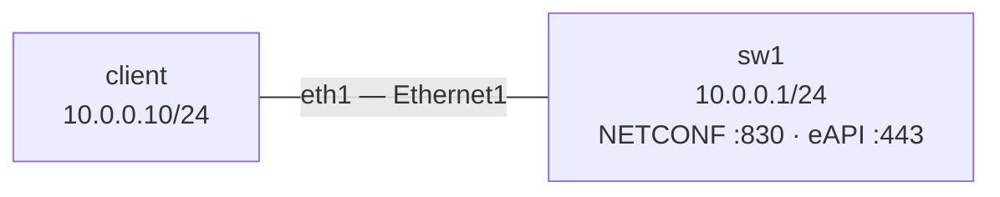

# Lab 51 — NETCONF / RESTCONF Foundations

> **Format:** Hands-on. Enable NETCONF and eAPI on a switch; query state and push a config change programmatically. Reference answer in [`solutions/`](solutions/).
>
> **Story chapter:** Phase 9 · Tech lead · Year 5+. Click-ops on 100+ devices doesn't scale. The team needs to write configs once and apply everywhere — idempotently, with diffs, with rollback. NETCONF (with YANG models) is the standards-track answer; eAPI is Arista's vendor flavor. Lab 52 builds Ansible on top; this lab is the protocol primer. See [`STORY.md`](../../STORY.md).

## Real-world scenario

Three problems with CLI-based config management:
1. **Not idempotent**: running the same script twice can produce different results. CLI is order-sensitive.
2. **Not transactional**: half-applied configs leave the device in an undefined state.
3. **Hard to diff**: comparing "what's actually there" vs "what we intended" is text-diff. Sensitive to ordering, formatting.

NETCONF solves all three:
- **YANG-modeled**: data is structured, not free text. Diffable structurally.
- **Transactional**: candidate → commit → confirmed-commit pattern. Either the whole change applies or nothing does.
- **Idempotent**: declarative ("the config should look like X") vs imperative ("type these commands").

## Protocols at a glance

| Protocol | Transport | Encoding | Standard | Use |
|---|---|---|---|---|
| **NETCONF** | SSH (port 830) | XML | RFC 6241 | Standards-track config protocol |
| **RESTCONF** | HTTPS | JSON or XML | RFC 8040 | REST-friendly NETCONF |
| **gNMI** | gRPC (port 6030) | protobuf | OpenConfig | Modern, telemetry+config |
| **eAPI** | HTTPS | JSON-RPC | Arista-specific | Send CLI commands, get JSON back |

On Arista, eAPI is the easiest entry point because it accepts CLI commands wrapped in JSON — no YANG learning curve. NETCONF is the standards-track answer. Choose based on:
- Multi-vendor environment → NETCONF (works on Cisco IOS-XR, Juniper, Nokia, Arista)
- Arista-only → eAPI is convenient
- New code today → gNMI (telemetry + config in one protocol)

> **A note on "RESTCONF" in this lab.** EOS does have a real RESTCONF agent (`management api restconf`, exposing `/restconf/data/...` over YANG-modeled resources). This lab does **not** configure it — instead it uses **eAPI** (`management api http-commands`, JSON-RPC over HTTPS) as a practical, low-friction stand-in for "HTTPS-based programmatic config". eAPI is *not* RESTCONF: it sends CLI commands wrapped in JSON-RPC to `/command-api`, with no `/restconf/data` URIs and no YANG-modeled resource tree. Treat the RESTCONF row in the table above as conceptual context; true `management api restconf` is left as an extension (see *What's missing*).
>
> **A note on gNMI.** The solution config also enables `management api gnmi` (port 6030) purely as a reference — it is **not** exercised in this lab and the topology does **not** publish 6030, so it is unreachable from the host. The `ssl profile NONE` in that block means cleartext gRPC (a lab-only convenience; never do that in production). gNMI is covered properly in labs 49-50.

## Topology



A trivial two-node line: one Linux client driving one cEOS switch over a shared /24. All programmatic access (NETCONF on 830, eAPI on 443) rides this single link.

## Goal

- Enable NETCONF and eAPI on the switch
- Run a `get-config` via NETCONF using `ncclient`
- Push a config change via eAPI using `curl`
- Understand the differences

## Theory primer

### NETCONF operations

- `get-config`: retrieve config from a datastore (running, candidate, startup)
- `edit-config`: apply changes to a datastore
- `copy-config`: copy one datastore to another
- `commit`: copy candidate to running
- `lock`/`unlock`: prevent concurrent edits
- `delete-config`: erase a datastore

The candidate datastore pattern:
```
1. lock candidate
2. edit-config (multiple changes)
3. validate
4. commit
5. unlock candidate
```

If anything fails before commit, the running config is untouched.

### YANG models

YANG describes the shape of the data. Two flavors:
- **OpenConfig**: vendor-neutral, narrower coverage
- **Vendor-native**: full coverage of that vendor's features (Arista has `arista-system`, `arista-bgp`, etc.)

Production-ish pattern: write your tooling against OpenConfig where it exists; fall back to vendor-native for vendor-specific features.

### eAPI and `"format"`

eAPI wraps CLI commands in JSON-RPC. The `"format"` field controls the *response* encoding:
- `"format": "json"` returns structured JSON — but only for commands that have a JSON model. Config-mode commands (`configure`, `interface ...`, `ip address ...`) return empty result objects and execute fine, and most `show` commands have a model too.
- Some `show`/exec commands have **no** JSON converter. Requesting `"format": "json"` for one of those returns a JSON-RPC error like *"This is an unconverted command... use format text"*. For those, send `"format": "text"` and parse the raw CLI output yourself.

Rule of thumb: `"format": "json"` is the right default; if you get an "unconverted command" error, switch that call to `"format": "text"`.

## Your task

1. Configure NETCONF and eAPI on the switch (in solution).
2. From the client, install ncclient (or curl for eAPI).
3. Pull the running config via NETCONF.
4. Push a config change via eAPI: add a loopback interface.

> NETCONF here is used **read-only** (`get-config`). The config *push* is done via eAPI, not NETCONF `edit-config` — that (and candidate/commit datastore semantics) is deliberately left for a later lab. See *What's missing*.

## Hints

You're enabling two management agents and bringing the interface up — no routing protocols, no fancy features. CLI verbs to reach for:

- Enter the NETCONF agent: `management api netconf`, then choose the SSH transport (`transport ssh default`).
- Enter the eAPI agent: `management api http-commands`, select `protocol https`, then `no shutdown` it (eAPI ships disabled).
- (Optional/reference) gNMI lives under `management api gnmi` with `transport grpc default`.
- The data interface needs `no switchport` + an `ip address`, and `ip routing` must be on so the client's default route works.
- From the client, NETCONF is `port 830` over SSH; eAPI is HTTPS on `443` at the `/command-api` path.

## Verification

### Install client tools
```bash
docker exec -it clab-netconf-restconf-client bash
apt update && apt install -y python3-pip curl
pip3 install ncclient
```

### NETCONF get-config
```python
# /tmp/netconf-get.py
from ncclient import manager

with manager.connect(host="10.0.0.1", port=830, username="admin",
                     password="admin", hostkey_verify=False,
                     # ncclient has no dedicated 'eos' handler; 'default' is the
                     # generic handler and is sufficient for read-only get-config.
                     # If you later move to candidate/commit edit-config, the
                     # default handler may not map Arista's datastore semantics
                     # cleanly — see "What's missing" below.
                     device_params={"name": "default"}) as m:
    config = m.get_config(source="running")
    print(config)
```

Run: `python3 /tmp/netconf-get.py`

### eAPI: push a loopback
```bash
curl -k -u admin:admin -H "Content-Type: application/json" \
  https://10.0.0.1/command-api -d '
{
  "jsonrpc": "2.0",
  "method": "runCmds",
  "params": {
    "version": 1,
    "cmds": [
      "configure",
      "interface Loopback99",
      "ip address 10.99.99.99/32"
    ],
    "format": "json"
  },
  "id": "lo-add"
}'
```

Verify:
```bash
curl -k -u admin:admin -H "Content-Type: application/json" \
  https://10.0.0.1/command-api -d '
{"jsonrpc":"2.0","method":"runCmds",
 "params":{"version":1,"cmds":["show ip interface brief"],"format":"json"},
 "id":"check"}'
```

## What's missing (deliberately)

- **NETCONF `edit-config`**: this lab pushes config via eAPI, not via NETCONF. The candidate → validate → commit → unlock datastore flow (and its rollback safety) is the natural next step but is out of scope here — get the read-only `get-config` working first.
- **True RESTCONF** (`management api restconf`, `/restconf/data/...` over YANG-modeled resources): eAPI stands in for "HTTPS programmatic config" in this lab. The real RESTCONF agent is left as an extension.
- **YANG model browsing** (`pyang`, `yanglint`)
- **OpenConfig translation libraries** (`pyangbind`)
- **Confirmed commit** with auto-rollback if not re-confirmed
- **NETCONF over TLS** (RFC 7589) instead of SSH
- **Bulk operations** patterns (Ansible's `netconf_config`, Nornir+Scrapli)

## Cleanup

```bash
sudo containerlab destroy --cleanup
```
