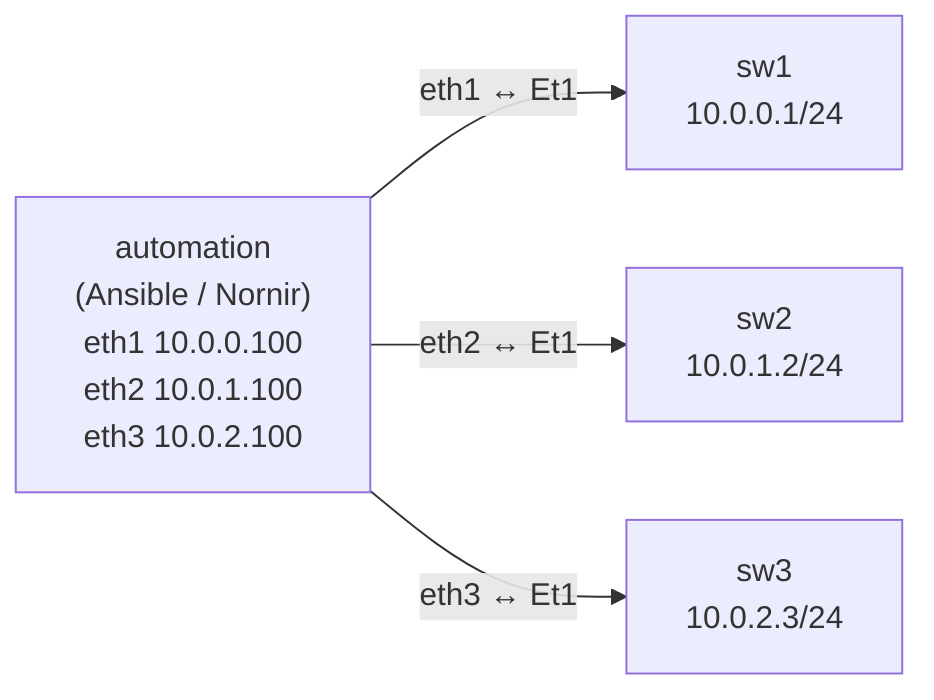

# Lab 52 — Ansible & Nornir for Network Automation

> **Format:** Hands-on. Apply baseline hardening to 3 switches via Ansible playbook. Reference also includes equivalent Nornir code for comparison. Reference answer in [`solutions/`](solutions/).
>
> **Story chapter:** Phase 9 · Tech lead · Year 5+. The Company runs 100+ switches across two DCs. "Apply the new NTP server everywhere" was a 4-hour click-through job. You introduce Ansible to do it in 30 seconds — and the wider team starts adopting it for everything. See [`STORY.md`](../../STORY.md).

## Real-world scenario

Day before: senior engineer applies baseline changes to 47 switches via SSH. Misses three. Two of the three drift from the standard. Six months later, an audit catches the drift; the missing changes are now load-bearing for compliance.

The pattern that prevents this:
1. Inventory in one place (which devices exist, what role each has)
2. Configuration as code (the intent, in a repo, reviewed)
3. Apply mechanically, idempotently, with diffs
4. Track which devices are in-sync vs drifted

Ansible (or Nornir) gives you the apply mechanism. A source-of-truth system (NetBox, an IPAM/CMDB — deferred to a dedicated chapter; see `TODO.md`) gives you the inventory. CI/CD (lab 53) wires them together.

## Goal

- Inventory three switches in Ansible
- Apply a baseline playbook (banner, syslog, NTP, idle timeout) to all of them
- Verify idempotency: rerun the playbook, see "0 changed"
- Read the Nornir equivalent and compare

## Topology

The automation host reaches each switch over its own point-to-point link. Each
link is a distinct /24, so the automation host installs one connected route per
switch (one IP per `ethN`). Putting all three switches in a single shared /24
across three separate p2p links would *not* work: Linux would install a single
connected route out `eth1`, and traffic to sw2/sw3 would be sent toward sw1 and
never arrive.



| Node | Link | Switch IP | Automation IP (target for syslog/NTP) |
|---|---|---|---|
| sw1 | automation:eth1 ↔ sw1:eth1 | 10.0.0.1/24 | 10.0.0.100 |
| sw2 | automation:eth2 ↔ sw2:eth1 | 10.0.1.2/24 | 10.0.1.100 |
| sw3 | automation:eth3 ↔ sw3:eth1 | 10.0.2.3/24 | 10.0.2.100 |

## Theory primer

### Ansible vs Nornir

| Aspect | Ansible | Nornir |
|---|---|---|
| Language | YAML (DSL) | Python |
| Audience | Ops folks, infra teams | Engineers comfortable in Python |
| Parallelism | Fork-per-host | True threading |
| Speed (100 hosts) | ~30s | ~5s |
| Ecosystem | Huge | Smaller but Python-native |
| Testability | Linters + Molecule | pytest, mypy, normal Python |
| Vendor coverage | Largest | Solid for major vendors |

Both work. Many shops use Ansible for "config push" and Nornir/Python for anything more complex (parsing, reconciling, multi-step workflows).

### Idempotency

Running the same playbook twice should produce the same result the second time as the first. If `changed: 0` on the second run, you have idempotency.

Anti-pattern: using `eos_command` (raw CLI) — every run reports "changed" because it doesn't know if the command did anything. Use `eos_config` with `parents:` and `lines:` (which checks current state), or the state-aware resource modules (`eos_banner`, `eos_ntp_global`, `eos_logging_global`).

> **Module note:** the legacy `eos_ntp` and `eos_logging` modules were removed from current `arista.eos` releases (what `ansible-galaxy collection install arista.eos` pulls today). The baseline playbook uses the resource-module replacements `eos_ntp_global` and `eos_logging_global` instead — same idempotency, current syntax.

### Inventory

YAML-based hierarchy: hosts → groups → group_vars. A device's effective config is the merge of: defaults → group_vars (most general first) → host_vars (specific overrides).

```yaml
all:
  vars:
    ansible_user: admin
  children:
    leaf:
      vars:
        snmp_community: read-only-secret
      hosts:
        leaf01: { ansible_host: 10.0.0.1 }
        leaf02: { ansible_host: 10.0.0.2 }
    spine:
      hosts:
        spine01: { ansible_host: 10.0.0.10 }
```

In production, this comes from a source-of-truth system (e.g., NetBox via `nb_inventory` plugin), not from hand-edited YAML files.

### Connection plugins for network devices

Three common ones:
- **network_cli**: SSH-based, sends CLI commands. Works on every legacy device.
- **httpapi**: HTTP-based, talks eAPI/RESTCONF. Faster, structured responses.
- **netconf**: NETCONF/SSH. Structured, transactional.

For Arista with eAPI: `httpapi` is the right choice (this lab uses it).

## Your task

1. Bring up the lab.
2. From the `automation` container, install Ansible.
3. Run the baseline playbook against all 3 switches.
4. Run it again — verify 0 changed.
5. (Optional) Read and understand `nornir-example.py`.

## Hints

- `ansible-playbook -i <inventory> <playbook>` runs a play; add `-v` for per-task detail.
- Before applying for real, dry-run with `--check --diff` to preview the changes Ansible *would* make without touching the devices.
- Idempotency check: the recap line at the end of a run shows `changed=N`. Run the playbook a second time — a correct, state-aware playbook reports `changed=0`.
- `ansible -i inventory.yml leaf -m arista.eos.eos_command -a 'commands="show version"'` is a quick ad-hoc reachability test against the whole group before you run the play.
- To confirm connectivity from the automation host first: `ping 10.0.0.1`, `ping 10.0.1.2`, `ping 10.0.2.3` — each switch is on its own subnet.

## Verification

### Install Ansible
```bash
docker exec -it clab-ansible-nornir-automation bash
apt update && apt install -y python3-pip
pip3 install ansible
ansible-galaxy collection install arista.eos
```

### Run the playbook
```bash
cd /lab/solutions
ansible-playbook -i inventory.yml playbook-baseline.yml
```

You should see `changed=N` on the first run, `changed=0` on the second.

### Spot-check a device
Each switch is on its own subnet (sw1 `10.0.0.1`, sw2 `10.0.1.2`, sw3 `10.0.2.3`):
```bash
ssh admin@10.0.0.1
sw1# show banner login
sw1# show running-config | include ntp|logging|exec-timeout
```
Repeat for `ssh admin@10.0.1.2` (sw2) and `ssh admin@10.0.2.3` (sw3). Each switch
should show its own automation-host address as the NTP/syslog target
(`10.0.0.100`, `10.0.1.100`, `10.0.2.100` respectively).

## What's missing (deliberately)

- **Roles** — modular playbook organization
- **Vault** for secrets
- **Dynamic inventory from a source-of-truth (NetBox/IPAM/CMDB)** — deferred; see `TODO.md`
- **Diff mode** (`--check --diff`) for dry-run
- **Templates** (Jinja2) for generated configs
- **CI integration** — lab 53

## Cleanup

```bash
sudo containerlab destroy --cleanup
```
