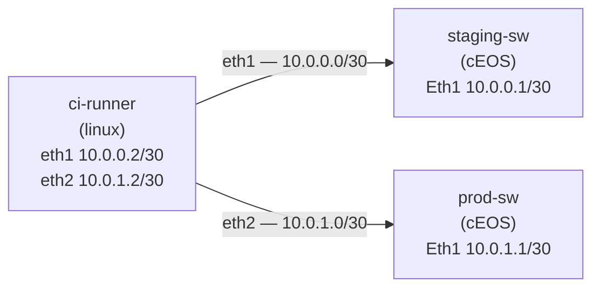

# Lab 53 — Network CI/CD Pipeline

> **Format:** Reference-heavy. Pipeline blueprint + sample test code. Lab 53 is more about workflow than about a config you apply to a switch — but the topology lets you run the pipeline locally against `staging-sw` and `prod-sw`. Reference in [`solutions/`](solutions/).
>
> **Story chapter:** Phase 9 · Tech lead · Year 5+. After the incident where a junior pushed a typo'd ACL straight to prod and broke customer reachability for 12 minutes, the team agrees: every config change goes through a pipeline. Lint, validate offline, deploy to staging, integration-test, then prod. See [`STORY.md`](../../STORY.md).

## Real-world scenario

The old workflow:
- Engineer SSHes into the switch, types commands, saves config
- Hopes they got it right
- Reviews their own work
- Pushes to prod

The new workflow:
- Engineer edits config in git
- Opens MR/PR
- CI lints (yamllint, ansible-lint, Batfish for the rendered config)
- CI applies to **staging** topology, runs integration tests
- Reviewer approves
- Merge → CI deploys to prod (manual gate)
- Smoke tests verify prod
- Rollback button is one revert + re-pipeline

This lab gives you the blueprint. You'll combine: git (source of truth), Ansible (apply mechanism, lab 52), tests (pytest + eAPI), and a CI runner (GitLab CI, GitHub Actions, etc.).

## Goal

- Understand the pipeline stages
- Read the example `.gitlab-ci.yml` and example test
- (Optional) Wire up to a local runner and execute against the lab switches

## Topology

The `ci-runner` (a plain Linux container that plays the part of your CI worker)
has one link to each switch, each in its own /30 so the runner has a distinct
connected route per device. eAPI (HTTPS) is enabled on both switches.



| Node | Interface | IP | Role |
|------|-----------|----|----|
| ci-runner | eth1 | 10.0.0.2/30 | faces staging-sw |
| ci-runner | eth2 | 10.0.1.2/30 | faces prod-sw |
| staging-sw | Ethernet1 | 10.0.0.1/30 | staging eAPI target |
| prod-sw | Ethernet1 | 10.0.1.1/30 | prod eAPI target |

## Theory primer

### The standard network pipeline shape

```
git push
   ▼
[lint] yamllint, ansible-lint, batfish (config semantic check)
   ▼
[validate] render config → diff against running → human review
   ▼
[stage-deploy] ansible-playbook → staging topology
   ▼
[stage-test] pytest integration tests (BGP up, reachability, ACL correctness)
   ▼
[prod-deploy] manual gate → ansible-playbook → prod
   ▼
[prod-verify] pytest smoke tests
   ▼
[done]
```

Each stage is independent — failure in any stage halts the pipeline. The `[validate]` and `[stage-test]` stages are the safety net that catches 95% of regressions before they hit prod.

### Batfish — config semantic linting

Batfish parses configs offline and answers questions like:
- "If I apply this BGP policy, will any prefix get unintentionally leaked?"
- "Does this ACL block what I intend? Permit what I don't?"
- "Are there reachability cuts in this design?"

Run as part of CI before any deploy. Great for catching policy regressions that pass syntax check but break intent.

### Why staging is critical

Most network bugs only manifest in real BGP convergence, real ARP timing, real concurrent flows. Static analysis can't catch them all. A staging topology that mirrors prod (or is at least the same topology pattern) is what catches:
- "We forgot to apply the new ACL to the peering interfaces"
- "The new route-map conflicts with the old community filter"
- "The MLAG peers re-elect after this config commit"

The smaller the staging-vs-prod gap, the better. Containerlab as staging is great: same images as prod, runs in CI, costs nothing.

### Rollback strategy

Two flavors:
1. **Forward fix**: detect bad state, write the corrective change, push through the same pipeline. Slow (5-10 min).
2. **Revert + redeploy**: git revert + redeploy → seconds to minutes. Need to ensure the previous config is still valid (no drift since).

Production: forward fix for non-critical, revert for "we just broke customer traffic." Both go through pipeline; never ssh-and-fix-by-hand.

### The pipeline-vs-incident tension

The pipeline is great for planned changes. For 3am-customer-down incidents, sometimes you have to fix things by hand. **That's OK** — but immediately after the incident:
- Write the fix into the repo
- PR + pipeline
- Apply through the pipeline so the running config matches git

Otherwise drift accumulates and the source-of-truth fiction breaks.

## Your task

Read the reference files in `solutions/`:
- `.gitlab-ci.yml`: the pipeline definition
- `test-bgp-up.py`: example integration test

Optional: set up a local GitLab runner or run `gitlab-runner exec` against the topology.

The bigger task is understanding the *workflow*, not the syntax.

## Hints

This is a reference/blueprint lab, so the "answer" is mostly *reading* the
files in `solutions/`. A few pointers for the optional hands-on part:

- Run pytest from inside the runner container; the eAPI tests just need
  `requests` and network reachability to each switch (`10.0.0.1`, `10.0.1.1`).
- To run a single CI job locally without a full GitLab server, look at
  `gitlab-runner exec docker <job-name>` (deprecated but still illustrative)
  or replicate the job's `script:` block by hand.
- eAPI auth here is `admin`/`admin` over HTTPS with a self-signed cert —
  that's why the test sets `verify=False` and calls `urllib3.disable_warnings()`.
- The interesting verbs for a real test suite: `show ip bgp summary`,
  `show ip route`, `show interfaces status`, all via the eAPI `runCmds` method.

## Verification

If you have a CI runner available, run the example test from inside the runner:

```bash
docker exec -it clab-network-cicd-ci-runner bash
pip install pytest requests
# Runs against both switches: 10.0.0.1 (staging) and 10.0.1.1 (prod)
pytest /lab/solutions/test-bgp-up.py -v
```

Expected result: **all tests pass.** Note *why* they pass:

- `test_bgp_peers_established` passes **vacuously** — the lab switches run no
  BGP and `EXPECTED_PEERS` is empty, so there is nothing to assert. This is
  intentional: the test demonstrates the eAPI *pattern* you would use against a
  real fabric, where `EXPECTED_PEERS` comes from your source of truth (NetBox,
  YAML inventory, etc.) and the test fails loudly if a peer is down.
- `test_no_critical_errors` actually queries each switch's log buffer over
  eAPI and asserts there are no `%CRITICAL`/`EMERG` entries — a real check.

Before this fix the runner could not reach the prod switch at all (both links
shared one /24, so the prod IP was unreachable and the test timed out). With
the two /30 links above, both devices are reachable and the suite runs clean.

## What's missing (deliberately)

- **A live CI runner integration** — out of scope; this lab is the pattern
- **Approval workflows** (deployment to prod requires N reviewers)
- **Blue/green deploys for network** — limited utility outside specific scenarios
- **Drift detection** — periodic comparison of running vs git; alerts on drift
- **Auto-rollback on smoke-test failure** — straightforward to add but error-prone

## Cleanup

```bash
sudo containerlab destroy --cleanup
```
