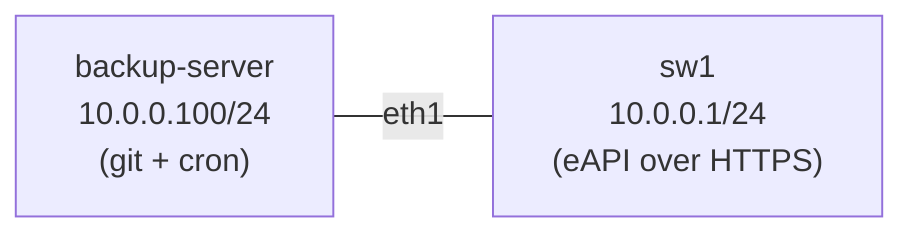

# Lab 55 — Network Device Backup & Disaster Recovery

> **Format:** Hands-on + procedural. Build automated config backup; walk the full "switch died, replace it" procedure. Reference scripts in [`solutions/`](solutions/).
>
> **Story chapter:** Phase 9 · Tech lead · Year 5+. A leaf switch died at 02:00. The replacement arrived at 09:00. The question every new tech asks: "now what?" You write the runbook that turns "panic, hope someone remembers the config" into "follow these 12 steps, you're back in 25 minutes." See [`STORY.md`](../../STORY.md).

## Real-world scenario

A switch dies. Could be a PSU, could be the fabric ASIC, could be cosmic rays. Doesn't matter — you have to get the replacement running with the right config in minimal time.

Without preparation:
- Hunt for last-known config in the wiki (does anyone know which version is current?)
- Manually paste it into the new switch
- Hope you have all the customer cross-connects documented
- Realize the new switch has a different MAC, so DHCP snooping bindings need updating
- 4 hours later, you're done. Customers were down.

With preparation:
1. Automated daily backups → known-good config in git
2. NetBox tells you which interfaces should be cabled where, which IPs go on which port
3. ZTP (Zero Touch Provisioning) deploys the config based on the switch's serial number
4. Validation tests run before traffic flows
5. 25 minutes from "switch installed" to "service restored"

This lab builds the backup half. A source-of-truth/inventory system (NetBox or equivalent) is the other half. That dedicated chapter isn't written yet — it's deliberately deferred (tracked in `TODO.md`), not assumed to exist elsewhere in the curriculum. So for *this* lab the **git-backed config is the source of truth**: the runbook's "pull from NetBox" steps describe the eventual workflow, but everything you actually need to recover sw1 lives in the git repo you build here.

## Goal

- Automated daily backup of every device's running config to git
- Diff alerts on unexpected changes (drift detection)
- ZTP procedure documented
- Validated recovery playbook

## Topology

A deliberately minimal topology: one switch to back up, and the backup server
that pulls its config over eAPI and commits it to git.



The backup server reaches sw1's eAPI at `https://10.0.0.1/command-api`. In a real
fabric you would back up every leaf and spine; the script loops over a device list,
so adding devices is just adding lines to that list.

## Theory primer

### Backup strategy

| Layer | What to back up | Frequency | Storage |
|---|---|---|---|
| Running config | `show running-config` output | Daily + on commit | Git (with offsite mirror) |
| Startup config | `show startup-config` | Daily | Git |
| Device facts | Serial, model, software version | Weekly | NetBox / CMDB |
| EOS images | The actual NOS binary | Per-version, manual | File server |
| Licenses | License file | At install + yearly | Vault/safe storage |
| EVPN / BGP state | (optional) for forensic post-DR | Pre-incident only | Telemetry archive |

### What "DR" means for a network device

Unlike servers, network device DR is *mostly* config + image:
- Hardware is replaceable (RMA, hot spare)
- State you actually need is small: config + interface mappings + cabling + tenant data
- ZTP makes the config-push step automated

The pieces that are hard to recover:
- Customer/tenant cross-connects (which port goes to whom) → NetBox
- Per-device unique identifiers (license, certificates) → vault
- Live BGP/EVPN learned state — comes back when the device rejoins the fabric

### ZTP (Zero Touch Provisioning) — Arista flavor

When an Arista switch boots without a startup config:
1. It DHCPs on all interfaces
2. The DHCP response includes a "bootfile" URL (TFTP/HTTP)
3. The switch downloads a config (or a small script that generates config based on its serial)
4. Boots into that config

To make this work:
- DHCP server returns a config-URL keyed off MAC or DHCP client ID
- Backup server hosts per-serial configs (or templates the config from NetBox at request time)
- Pre-stage the configs for any devices you might need to replace

### Drift detection

A daily diff between the in-repo backup and a fresh `show running-config` reveals:
- Authorized hand-edits not yet pushed back to git
- Unauthorized changes (someone bypassed the pipeline)
- Configs that "rolled back" themselves (rare, but happens with bad upgrades)

Alert on any non-trivial diff. Either the human-edit gets committed to git, or the device gets re-applied from git.

### What to test after recovery

Before announcing the device "back":
1. Interface counts match expected
2. BGP peers all Established
3. EVPN VTEP discovered by other leaves
4. ACLs in place (count match)
5. End-to-end ping for sample tenants
6. No errors in last 1 hour of logs (post-boot)

Automate. The on-call engineer doesn't remember the checklist at 03:00.

## Your task

The goal state: a git repo on the backup server that holds sw1's running-config,
updated automatically and committing only when something changed.

1. Read `solutions/backup-configs.sh`. Understand each step — where it gets the
   device list, how it authenticates to eAPI, when it commits.
2. Make sure the script has an inventory to work from. It reads one eAPI address
   per line from `/etc/network-backups/devices.txt`. The topology pre-stages this
   file with sw1's address (`10.0.0.1`); confirm it's there, or create it yourself.
   (sw1's eAPI listens on its Ethernet1 address — see `configs/sw1.cfg`.)
3. The script authenticates as the eAPI user `admin`. Export that user's password
   so the script can read it (`configs/sw1.cfg` sets it). Then run the script once
   by hand and watch it produce the first git commit.
4. Set up a cron job (on the backup server) to run it daily.
5. Modify the switch config; rerun the backup; observe the second git commit and diff.
6. Sketch your own recovery runbook. Reference the runbook template in `docs/practice/templates/`.

## Hints

- The script refuses to run until `EAPI_PASSWORD` is set — it's an env var.
  The eAPI user is `admin`; its password is whatever `configs/sw1.cfg` configures
  (look at the `username admin ... secret` line). Export it before running.
- Get a shell on the backup server with `docker exec -it <node> sh` (the node name
  is `clab-backup-and-dr-backup-server`).
- For the daily run, `crontab -e` on the backup server. Remember cron has a bare
  environment, so set `EAPI_PASSWORD` inside the crontab line or a wrapper.
- Inspect what the backup captured with `git -C /backups/configs log --oneline`
  and `git -C /backups/configs show`.

## Verification

Run on the backup server (`docker exec -it clab-backup-and-dr-backup-server sh`):

```bash
export EAPI_PASSWORD=admin
/lab/backup-configs.sh          # or wherever you placed the script
```

You should see `backing up 10.0.0.1...` then `committed config changes`. Confirm:

```bash
# A commit exists, authored by the script:
git -C /backups/configs log --oneline
#   <hash> automated backup 2026-...Z

# The captured config is sw1's running-config:
grep -m1 hostname /backups/configs/10.0.0.1.cfg
#   hostname sw1
```

Now prove drift detection works. Change something on sw1 and re-run:

```bash
# on sw1:  Cli -> conf -> interface Ethernet1 -> description BACKUP-TEST
# back on backup-server:
/lab/backup-configs.sh
git -C /backups/configs log --oneline   # now TWO commits
git -C /backups/configs show            # the diff shows your description line
```

If you run the script a third time with no change, it prints `no config changes`
and makes no commit — that's the desired behaviour (commit only on real drift).

> The final `git push origin HEAD` will print `no remote configured` because this
> lab has no upstream remote — that's expected. In production you'd add a remote so
> backups land offsite.

## Recovery procedure (the runbook)

A backup is only half the story — recovery needs a *tested* procedure. This is the
runbook a junior can follow at 3 AM when a switch dies (also in `solutions/`):

```
== Switch Replacement Procedure ==

PRE-WORK (during incident triage):
1. Confirm device is genuinely dead (out-of-band ping, console, peer's LLDP)
2. Identify spare in inventory
3. Pull last config from git: backup-server:/backups/configs/<device>.cfg
4. Pull cabling map from NetBox: which interfaces go where
5. Pull tenant list affected for status updates

PHYSICAL:
6. Pull old switch from rack
7. Install spare; connect to:
   - OOB mgmt
   - Console
   - Power
   - Data links AS NETBOX SPECIFIES (don't guess)

CONFIG LOAD:
8. ZTP: spare boots, fetches config from backup-server (auto)
   OR manual: copy <device>.cfg via OOB to startup-config, reload
9. Verify hostname, primary IP, SSH access from mgmt network

VALIDATION (before re-cabling data interfaces if hot-stage was used):
10. Run pytest /lab/post-recovery-tests.py --device=<name>
   - Interface up counts
   - BGP peers all Established
   - EVPN VTEPs discovered
   - ACLs counted
11. Sample tenant ping

ANNOUNCE:
12. Status update: "service restored"
13. Schedule postmortem within 48h
```

## Peek at solution

The full reference backup script lives at [`solutions/backup-configs.sh`](solutions/backup-configs.sh).
There's no per-device "answer" config to reveal here — the deliverable is the
*automation* (the script + cron + git repo) and the *runbook* above, not a target
switch config. `configs/sw1.cfg` is just the device-under-backup.

## What's missing (deliberately)

- **Live ZTP server** (DHCP + HTTP + per-serial config generator)
- **Hot-spare warm config testing** — staging without traffic
- **Certificate/identity recovery** — TPM, RadSec creds, etc.
- **Multi-device cascade** (what if 3 leaves die at once? capacity planning)

## Cleanup

```bash
sudo containerlab destroy --cleanup
```
