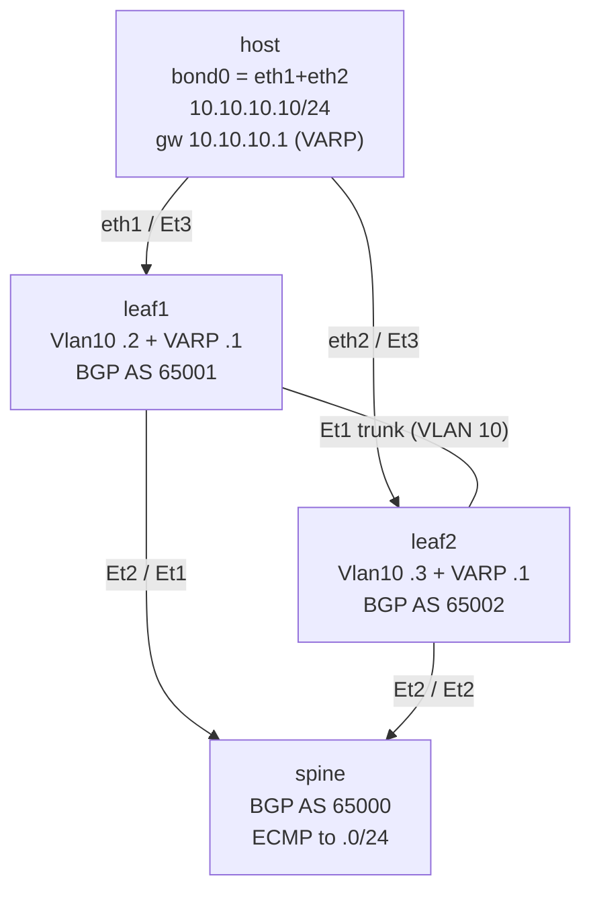

# Lab 56 — Hitless Upgrade / Rolling EOS Upgrade

> **Format:** Procedural / runbook. The lab provides a **redundant leaf pair** (shared VARP gateway, L2-stretched VLAN, bonded host) so you can rehearse the upgrade dance and watch the ping survive; the focus is the **steps and decision points**, not a config you push. Reference in [`solutions/`](solutions/).
>
> **Story chapter:** Phase 9 · Tech lead · Year 5+. A new EOS version has a critical CVE fix. You need to upgrade 40 leaves and 4 spines without disrupting traffic. A bad upgrade is worse than the CVE. You write — and lead — the maintenance procedure that gets the fleet upgraded in two evenings with zero customer impact. See [`STORY.md`](../../STORY.md).

> **cEOS limitation — `reload fast-boot` / SSU is hardware-only.** Arista's
> accelerated/hitless reload (Smart System Upgrade, `reload fast-boot`) depends
> on the **ASIC retaining forwarding state** across the kernel reboot. cEOS is a
> container with no ASIC, so `reload fast-boot` is **not meaningful here** — the
> theory below explains it because you'll use it on real gear, but in this lab
> the actual "upgrade" is just a plain container restart (the device goes fully
> down for ~tens of seconds and the *redundancy* — not fast-boot — is what keeps
> the ping alive). Treat the fast-boot section as fleet knowledge, not a lab step.

## Real-world scenario

"Just reload the switch with the new image" is fine for the kitchen network. For a production DC fabric, a reload during business hours = customer outage = SLA breach. Even at 02:00 maintenance windows, a *bad* reload can cause hours of cascading issues.

The hitless upgrade pattern depends on the redundancy you've already built:
- **MLAG pair**: upgrade one peer while the other carries all traffic. LACP failover < 1s.
- **EVPN multihoming (ESI)**: same idea — drain one ES member, upgrade, undrain, repeat.
- **Spine layer**: upgrade one spine at a time. ECMP-redistributed traffic loses 1/N of capacity briefly.
- **Edge**: drain via BGP AS-prepending or local-pref, upgrade, undrain.

This lab walks the **leaf upgrade dance** on a redundant pair. To keep the focus
on *procedure* (not on rebuilding MLAG, which is lab 14), the lab uses the
simplest redundancy that actually makes the failover work in cEOS: a **shared
VARP gateway** on both leaves, VLAN 10 stretched across the peer-link, and a
**bonded host**. On real gear this would typically be a full MLAG pair or EVPN-MH
ES — the *upgrade steps are identical*; only the redundancy mechanism differs.

## Topology



- Both leaves answer ARP for the **shared** gateway `10.10.10.1` (VARP virtual
  address + shared virtual MAC), so the host's default gateway survives losing
  either leaf.
- The **peer-link is an 802.1Q trunk carrying VLAN 10**, so `leaf1:Eth3` and
  `leaf2:Eth3` sit in one broadcast domain.
- The host **bonds eth1+eth2 (active-backup)** into `bond0`, presenting one
  MAC/IP and using whichever uplink is up.

## Goal

- Understand the drain → upgrade → validate → undrain pattern
- Practice executing it (in the lab) without dropping pings from the host
- Recognize the gotchas: peer-link semantics, EVPN sync, BGP graceful restart

## Theory primer

### Drain methods

Move traffic *off* the device before reload. Common patterns:

| Layer | Drain method |
|---|---|
| BGP peer | AS-prepend outbound; raise local-pref on alternate paths |
| MLAG | Shut peer-link's keepalive momentarily? No — better: shut access ports on the draining peer (orphan LAGs go to the surviving peer via LACP failover) |
| EVPN-MH | Lower this node's **ES DF-election preference** (`evpn ethernet-segment` → `designated-forwarder election preference <low>`) — or administratively isolate the ES — so it stops being DF and withdraws reachability; BUM/known-unicast traffic shifts to the other ES member |
| L3 ECMP path | Cost-out via routing protocol metric increase |
| Edge (transit) | Withdraw advertised routes via route-map |

After drain, the device should be carrying no traffic. Reload safely.

### Reload modes — `reload` vs `reload fast-boot`

- **`reload`**: full reboot, full reinit. 90-180s outage on this device. With a redundant peer, traffic continues via the peer.
- **`reload fast-boot`** (Smart System Upgrade / SSU; `reload hitless` is an alias): Arista's optimized reload — kernel boots, the **ASIC keeps forwarding state** for a few seconds, sessions reattach. Outage ~10s. Pre-validate with `show reload fast-boot`. **Hardware-dependent** — it relies on the ASIC, so it is *not available in cEOS* (see the cEOS callout at the top). EOS User Guide 4.36.0F §8.2.
- **In-Service Software Upgrade (ISSU)**: zero-outage upgrade on hardware that supports it. Rare and finicky; some software upgrades don't qualify.

On real leaves/spines you'd reach for `reload fast-boot` first and fall back to a
full `reload` (on the *drained* device, traffic on the surviving peer) when the
upgrade doesn't qualify for fast-boot. **In this cEOS lab there is no ASIC**, so
the "reload" step is simply a container restart and the device goes fully down —
the redundancy (VARP + bonded host), not fast-boot, is what keeps the ping alive.

### Validation between each step

This is the **general fleet checklist** you'd codify into a validation script.
Not every item applies to every device — tick only the ones a given device
actually runs. The ✅ items are the ones exercised in *this* simplified lab:

1. ✅ EOS version matches target
2. ✅ All expected interfaces up, in expected state (incl. `Vlan10`, peer-link trunk)
3. LACP bundles formed — *N/A in this lab* (no port-channels here; relevant on real MLAG, lab 14)
4. ✅ All BGP peers established (each leaf ↔ spine; check with `show ip bgp summary`)
5. EVPN VTEP discovery complete — *N/A in this lab* (no EVPN here; relevant on EVPN-MH fabrics, lab 33b)
6. ACL counts match expected — N/A (no ACLs in this lab)
7. ✅ No errors in startup logs

Automated, fast (< 30s). The on-call engineer doesn't manually scroll through `show ip bgp summary` at 02:30.

> This lab runs a **VARP redundant pair with an eBGP underlay** — there is **no
> MLAG and no EVPN** here. `show mlag` and `show evpn` will return nothing; they
> are in the general runbook above for fabrics that *do* run those features.

### Common gotchas

- **MLAG peer-link MTU mismatch after upgrade** → peer-link flaps → split brain → bad. Verify MTU before reload.
- **EVPN learned MACs missing on upgraded leaf** → MAC moves not seen → some hosts unreachable → wait for EVPN reconvergence (~30s) before declaring upgrade done.
- **Software changes default values** (rare but real). Read release notes. A specific case: STP defaults changed between EOS major versions for some platforms.
- **License re-check on reload**: some feature licenses might re-evaluate at boot. If your license file moved, certain features go offline.

## Runbook — redundant-leaf-pair upgrade

```
== Hitless Leaf Upgrade (redundant pair: leaf1 + leaf2) ==

PRE:
1. Both leaves currently active, gateway redundant (VARP)
2. Upgrade image staged on both leaves (file transferred, verified)
3. Maintenance window communicated; status page updated
4. Backup configs taken (lab 55)
5. Snapshot of pre-state (this lab): `show ip virtual-router`,
   `show ip bgp summary`, `show ip route 10.10.10.0/24`, per-interface counters.
   (On a real MLAG/EVPN fabric you'd also snapshot `show mlag` / `show evpn`.)

STEP A — UPGRADE leaf1:
  A1. Drain leaf1: shut the access port(s) on leaf1 (here: Ethernet3)
     (the host's bond fails over to leaf2, which also owns the VARP gateway;
      verify with the host ping)
  A2. Verify zero traffic on leaf1's access ports (counters flat for 30s)
  A3. Save config: `copy running-config startup-config`
  A4. Reload with new image (REAL gear):
      `boot system flash:/EOS-4.36.0F.swi`
      `reload`        (or `reload fast-boot` where the platform supports it)
      -- IN THIS cEOS LAB there's no ASIC / no .swi: just restart the
         container, e.g.  sudo containerlab restart -n leaf1
  A5. Wait for boot (~tens of seconds in cEOS; ~3 min on real gear)
  A6. SSH back in, run validation script
  A7. If validation PASSES: undrain (no shut access ports)
      verify traffic returns to balanced state
  A8. If validation FAILS: rollback (boot prior image, reload, investigate)

STEP B — UPGRADE leaf2 (same procedure as STEP A):
  Mirror of A. After this both peers run new EOS.

POST:
  - 24-hour soak: monitor for errors, anomalies
  - Update NetBox: device software version field
  - Postmortem if anything unexpected happened (even non-disruptive)
```

## Your task

Goal state: drive both leaves through the drain → "upgrade" → validate → undrain
cycle, one at a time, while the host's ping to `10.10.10.1` keeps flowing.

1. Read the runbook and confirm the pre-state (gateway redundant, BGP up).
2. From the lab host, start a continuous ping to the gateway and watch the loss count.
3. Drain `leaf1` by isolating its access port so the host's traffic moves to leaf2.
4. Confirm the ping is still flowing (it fails over to leaf2, which also owns the VARP gateway).
5. "Reload" leaf1 — in this lab that's a container restart (no `.swi`, no fast-boot; see the cEOS callout).
6. After it boots, validate (version, interfaces, BGP), then undrain leaf1.
7. Repeat the whole cycle for leaf2.

Total ping loss during a well-executed upgrade: 0-2 packets per peer transition.

## Hints

- Ping with a tight interval and a count so you can read the loss summary, e.g.
  `ping -i 0.1 -c 200 10.10.10.1` (run inside the host: `docker exec -it clab-hitless-upgrade-host bash`).
- "Drain" = take the host-facing access port out of service. The CLI verb to take
  an interface down is `shutdown` (under `interface Ethernet3`); `no shutdown` undrains.
- "Reload" in cEOS = restart the container, not an EOS `.swi` boot. Use
  `sudo containerlab restart -n leaf1` (or `docker restart clab-hitless-upgrade-leaf1`).
- Confirm the shared gateway with `show ip virtual-router`; confirm the underlay
  with `show ip bgp summary` (leaf↔spine) and `show ip route 10.10.10.0/24` on the spine.
- Watch the bond on the host: `cat /proc/net/bonding/bond0` shows the active member
  flipping between eth1 and eth2 as you drain each leaf.

## Verification

1. **Steady state (before draining):** on the host, `ping -c 5 10.10.10.1`
   succeeds; `cat /proc/net/bonding/bond0` shows one active member; on each leaf
   `show ip virtual-router` lists `10.10.10.1` active on `Vlan10`; on the spine
   `show ip route 10.10.10.0/24` shows the prefix learned via **both** leaves.
2. **During the leaf1 drain:** start `ping -i 0.1 -c 200 10.10.10.1`, then shut
   `leaf1:Ethernet3`. The ping keeps flowing; the bond's active member flips to
   `eth2`. Expect **0-2 dropped packets** in the final ping summary.
3. **During the leaf1 reload:** restart the leaf1 container. Because the host is
   already on leaf2, the ping should not drop at all during the reload itself.
4. **Undrain + repeat:** `no shutdown` on `leaf1:Ethernet3`, confirm BGP
   re-establishes (`show ip bgp summary`), then run the same cycle on leaf2.
5. **Total loss** across the whole exercise should be a handful of packets, not
   an outage. If the ping *stops*, the gateway redundancy isn't working —
   re-check VARP and the peer-link trunk against [`solutions/`](solutions/).

## What's missing (deliberately)

- **Real MLAG protocol config** (`mlag configuration` stanza) — the lab uses VARP + a stretched VLAN for gateway redundancy; full MLAG is covered in lab 14. The upgrade *procedure* is identical either way.
- **Real ISSU / `reload fast-boot` walkthrough** — hardware-specific (ASIC state), not exercisable in cEOS; requires real gear.
- **EVPN-MH pair upgrade** — same pattern; configuration covered in lab 33b.
- **Cluster reload of spines** — different runbook; spines drain via BGP cost, not by shutting ports.

## Peek at the solution

Reference configs and a worked runbook/validation walkthrough are in
[`solutions/`](solutions/): `leaf1.cfg`, `leaf2.cfg`, `spine.cfg`, and
[`solutions/validate.md`](solutions/validate.md).

## Concept reinforcement

- The upgrade is only "hitless" because of **redundancy you built earlier** — the
  reload itself is disruptive on the single device; the *fleet* stays up because
  a second device carries the traffic. Drain first, always.
- A **shared/virtual gateway** (VARP here; anycast gateway / MLAG VARP / VRRP
  elsewhere) is what lets a host keep its default gateway when one device leaves.
- **Validate before you undrain.** Returning a half-healthy device to service is
  how a maintenance window turns into an incident.

## Cleanup

```bash
sudo containerlab destroy --cleanup
```
