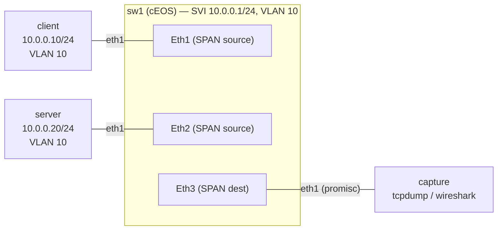

# Lab 57 — Production Packet Capture (SPAN/Mirror) + Traffic Generation

> **Format:** Hands-on. Configure a SPAN session, capture from the mirror destination, generate test traffic. Reference answer in [`solutions/`](solutions/).
>
> **Story chapter:** Phase 9 · Tech lead · Year 5+. A customer reports "intermittent connection resets." No drops visible in counters. You need to *see* the actual packets — but you can't `tcpdump` on the switch CPU (too much traffic; CPU melts). The fix: port mirror. Same idea for generating test traffic during validation. See [`STORY.md`](../../STORY.md).

## Real-world scenario

Three production debug scenarios this lab covers:

1. **"Why is this connection failing?"** — mirror the two endpoints' ports, capture from a side box, analyze in Wireshark.
2. **"Are we seeing the malicious traffic the IDS reports?"** — mirror to a security appliance.
3. **"Did our QoS change actually mark DSCP correctly?"** — mirror egress, decode, verify.

The pattern: dedicated **capture box** with a NIC in promiscuous mode, receives a copy of every packet of interest. Original traffic is unaffected.

## Goal

- Configure a SPAN (Switched Port ANalyzer) session
- Capture mirrored traffic on a dedicated host
- Generate test traffic with `iperf3` and `scapy`

## Topology



`client` and `server` are normal hosts in VLAN 10. The SPAN session mirrors
Eth1 + Eth2 (both directions) out Eth3, where the `capture` box passively
records every frame.

## Theory primer

### SPAN — port mirroring

The switch copies every packet on **source ports** (or VLAN) to a **destination port**, in hardware. The destination port can't be used for normal traffic — it only emits the mirrored copies.

- **Direction**: ingress, egress, or both (`tx`, `rx`, `both`)
- **Filter**: optional ACL to limit what gets mirrored (essential for high-volume ports)
- **Multiple sources, one destination**: aggregate several ports into one capture stream
- **Multiple destinations**: some platforms support multiple SPAN destinations per session

Limits:
- Destination port bandwidth ≥ sum of source ports' traffic, or you'll drop mirrored frames
- Mirrored copies don't include switch-internal modifications (some platforms; verify)
- Doesn't show switch CPU traffic — only data-plane
- **Session budget**: on real hardware each mirror direction costs a session. On Trident/Trident II platforms, mirroring `rx` or `tx` uses one session and `both` uses **two** sessions per source, against a hard cap (often 4 sessions total). So `source EthX both` on several ports can exhaust the budget fast — aggregate sources or filter with an ACL when mirroring many ports.

> **cEOS note (this lab runs on containerized EOS):** cEOS implements local SPAN in the data plane, so the capture box really does receive mirrored copies and the verification below works as written. What cEOS does **not** model is the hardware *session/ASIC budget* described above — on cEOS you won't hit the Trident 4-session cap, and `both` doesn't consume two real hardware sessions. The config syntax is identical to hardware; only the resource accounting is absent. (Same honesty pattern as labs 38 and 47, where a feature is control-plane / config-only on cEOS.)

### RSPAN and ERSPAN

- **Local SPAN**: source and destination on same switch (this lab)
- **RSPAN (Remote SPAN)**: mirrored traffic tagged in a special VLAN, carried across switches to a remote capture box
- **ERSPAN**: tunnels mirrored frames over IP (GRE/IPSec). Capture box can be anywhere.

Use ERSPAN when the capture box is in a separate site or the mirror needs to traverse L3 boundaries.

### When SPAN isn't enough

- **Sampled netflow / sFlow**: 1-in-N sampling, much less data, good for traffic analysis at scale
- **TAP devices**: physical inline taps that copy at line rate, no switch involvement
- **In-line packet broker**: aggregates from multiple taps, filters, distributes to multiple tools

For a hosting/cloud provider, SPAN works for ad-hoc debugging. Permanent monitoring uses sFlow + flow tools.

### Traffic generation

To validate config (rates, ACLs, QoS), you need known-shape traffic:

| Tool | What it does |
|---|---|
| `iperf3` | Throughput, UDP/TCP, configurable rate and size |
| `scapy` | Build any packet you can imagine (custom flags, TTL, fragments, malformed) |
| `hping3` | Variant; good for SYN floods, fragments |
| `nping` (nmap) | Configurable scans |
| `trex` | Stateful, multi-million-pps; needs DPDK |
| `pktgen-dpdk` | Kernel pktgen; line rate at small packet sizes |

For most validation: `iperf3` for throughput, `scapy` for protocol fuzzing.

## Your task

1. Configure SPAN: source = Ethernet1 + Ethernet2, destination = Ethernet3.
2. Generate traffic: `client` → `server` (iperf3 + a few crafted scapy packets).
3. Capture on `capture` and verify you see both directions.

## Hints

- On the switch, the mirror session is built with `monitor session <name> source ...` and `monitor session <name> destination ...`. Direction keywords are `rx`, `tx`, `both`.
- Inspect what you built with `show monitor session <name>`.
- To filter (production), attach an `ip access-list` to the source with the `ip access-group` keyword on the `source` line.
- On the capture box, record with `tcpdump -i <iface> -w <file>` and read back with `tcpdump -r <file>`. The destination interface needs **promiscuous mode**, not an IP.
- Generate load with `iperf3 -s` (server) / `iperf3 -c <ip>` (client); craft custom packets with `scapy`.

## Verification

### Apply SPAN
```bash
docker exec -it clab-span-capture-sw1 Cli
configure
monitor session DEBUG source Ethernet1 both
monitor session DEBUG source Ethernet2 both
monitor session DEBUG destination Ethernet3
end
show monitor session DEBUG
```

### Set up capture
```bash
# -U flushes each packet to the file immediately, so reading it back right
# after a short run isn't blocked by tcpdump's write buffer.
docker exec -d clab-span-capture-capture tcpdump -i eth1 -U -w /tmp/mirror.pcap
```

> The `capture` box's eth1 has IP `10.99.0.10/24`, but that address is **not**
> load-bearing — a SPAN destination only *emits* mirrored copies and is never
> addressed by the mirrored flows. What makes the capture work is **promiscuous
> mode** (`ip link set eth1 promisc on`, set in the topology). The IP is there
> only so the interface isn't completely unconfigured; you can ignore it.

### Generate traffic
```bash
docker exec -d clab-span-capture-server iperf3 -s
docker exec clab-span-capture-client iperf3 -c 10.0.0.20 -t 10
```

### Inspect capture
```bash
# Stop the backgrounded tcpdump first so the pcap is fully flushed/closed.
docker exec clab-span-capture-capture pkill tcpdump
docker exec clab-span-capture-capture tcpdump -r /tmp/mirror.pcap -nn -c 20
docker exec clab-span-capture-capture tcpdump -r /tmp/mirror.pcap -nn | head
```

You should see both client → server and server → client packets.

### Scapy example (custom packet)

The `client`/`server`/`capture` nodes use the Alpine-based
`ghcr.io/srl-labs/network-multitool` image, which ships `scapy` (and `tcpdump`,
`iperf3`) **preinstalled** — there's no `apt`, and you don't need to install
anything. Just craft and send:

```bash
docker exec clab-span-capture-client python3 -c "
from scapy.all import *
# Send a malformed TCP SYN with weird flags
send(IP(dst='10.0.0.20')/TCP(dport=80, flags='FSPU', sport=12345), count=5)
"
```

> If your multitool tag is ever missing scapy, install it the Alpine way
> (`apk add --no-cache py3-scapy`), not with `apt`.

The capture box sees it. Useful for testing IDS rules, ACL behavior, etc.

## Production considerations

- **Filter aggressively**: mirroring 10G of traffic to a 1G destination drops most of what you wanted.
- **Privacy**: mirrored traffic often includes customer data. ACL the SPAN to only the flows you actually need; clean up the SPAN session after.
- **Time-box**: leaving a SPAN running consumes resources. Add a "remove SPAN" step to your incident postmortem.
- **Don't mirror to a port that has anything else attached** — confusing and risky.

## What's missing (deliberately)

- **ERSPAN configuration** — vendor-specific tunneling syntax
- **sFlow / Netflow** export for continuous flow analysis
- **In-line TAP devices**
- **Hardware-accelerated capture** (Endace, Napatech, etc.)
- **Packet broker integration** (Gigamon, Arista DANZ)

## Cleanup

```bash
sudo containerlab destroy --cleanup
```
