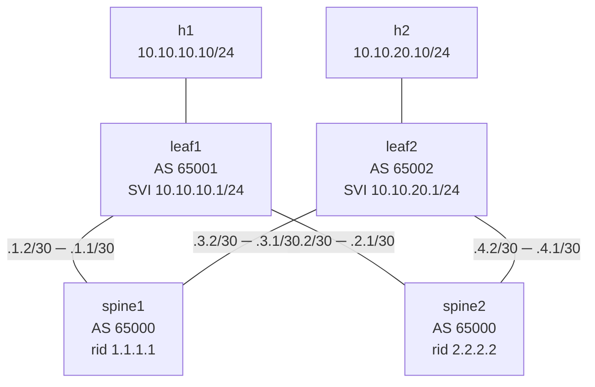

# Lab 58 — Failure Scenario Playbook

> **Format:** Chaos-experiment runbook. Inject failures into a fabric, observe blast radius, follow scripted response. Reference observations in the README itself.
>
> **Story chapter:** Phase 9 · Tech lead · Year 5+. A new junior joined the team. You write a failure playbook they can follow at 3 AM — every common failure, what it looks like, what to do, when to escalate. The junior is the reason; *you* benefit too because you can't expect a senior on call every night. See [`STORY.md`](../../STORY.md).

## Real-world scenario

At 3 AM, a junior gets paged. The on-call rotation has them as primary. They've been on the team 3 weeks. They don't know if "BGP session FlapDetected" is bad. They don't know if losing one spine is an outage. They don't know what to escalate.

The failure playbook fixes that:
- For each common failure type: what it looks like in monitoring, what to check, what to do, when to escalate
- Designed for someone who's competent but new
- Each scenario tested in a lab (this one) so the response actually works

This lab is a fabric where you can inject failures and run through the response.

## Goal

- Experience each of the major failure types
- Follow the suggested response steps
- Calibrate: "how bad is this?" "what's the right action?"

## Topology

A small leaf-spine fabric: two spines, two leaves, one host hanging off each leaf. Every leaf has a /30 point-to-point link to *each* spine, so each leaf has two equal-cost uplinks (this is what makes the S1 "one spine dies, traffic survives via the other" story work). eBGP underlay: spines are AS 65000, leaf1 is AS 65001, leaf2 is AS 65002.



| Link | Leaf side | Spine side |
|------|-----------|------------|
| leaf1 Eth1 ↔ spine1 Eth1 | 10.99.1.2/30 | 10.99.1.1/30 |
| leaf1 Eth2 ↔ spine2 Eth1 | 10.99.2.2/30 | 10.99.2.1/30 |
| leaf2 Eth1 ↔ spine1 Eth2 | 10.99.3.2/30 | 10.99.3.1/30 |
| leaf2 Eth2 ↔ spine2 Eth2 | 10.99.4.2/30 | 10.99.4.1/30 |

h1 (10.10.10.10) sits in tenant VLAN 10 behind leaf1; h2 (10.10.20.10) sits in VLAN 20 behind leaf2. Each leaf advertises its tenant prefix (`network 10.10.10.0/24` / `10.10.20.0/24`) into BGP, and both leaves run `maximum-paths 4` so they install both spine paths as ECMP.

## Theory primer

This isn't a build-a-feature lab — the fabric is already converged. The skill you're practising is **blast-radius reading**: given a failure, how much of the network is actually affected, and how urgent is it?

- **Redundant vs. single-homed.** A spine or a single leaf uplink failing is survivable because of the dual-uplink + ECMP design — the fabric routes around it. A *leaf* failing (or its host link) is not survivable for that leaf's tenants, because the host is single-homed to one leaf. Same fabric, very different severity.
- **Control-plane vs. data-plane symptoms.** A BGP session dropping (control plane) and a host losing reachability (data plane) look different in monitoring and demand different first checks. Part of calibration is mapping a symptom back to its layer.
- **Severity tiers.** Each scenario below is tagged sev1–sev3. The point is to internalise the difference between "page a human now" and "file a ticket for business hours". Over-escalating burns the on-call's trust; under-escalating risks an outage.

## Failure scenarios in this lab

### S1: Spine fails

**Trigger:**
```bash
docker stop clab-failure-playbook-spine1
# Hard kill (no graceful stop): docker kill clab-failure-playbook-spine1
```

> **Why not `shutdown -h now` inside the container?** cEOS isn't a hardware switch with a real init — PID 1 is the EOS supervisor shim, not systemd, so `docker exec ... shutdown -h now` either errors or doesn't cleanly halt the node. To take a node offline under containerlab you stop the *container* (`docker stop`/`docker kill`), which is exactly what S5 does. (There is no `containerlab tools kill` subcommand — `containerlab tools` covers `cert`, `netem`, `veth`, `vxlan`, `mtu`, `disable-tx-offload`, etc.)

**Observed in monitoring:**
- BGP sessions from leaf1 (to spine1 10.99.1.1) and leaf2 (to spine1 10.99.3.1) drop out of Established — you'll see `Active`/`Connect` briefly as the FSM retries, then the neighbor row stays stuck (not `Idle`; Idle is the initial/admin-down state)
- Interface counters on leaf1 Eth1, leaf2 Eth1 → no traffic
- Ping h1 → h2: works via spine2 (ECMP failover); some flows reset
- Alerting: "spine1 unreachable"

**Response:**
1. Confirm with `show bgp summary` on a surviving leaf — only spine2 sessions Established
2. Check capacity: is spine2 alone sufficient? (50% of fabric capacity)
3. If yes → file ticket for hardware replacement (sev2, not sev1)
4. If no → emergency response: degrade non-critical tenants, request expedited replacement
5. Update status page if customer-facing impact

**Escalate to senior if:** spine2 also has issues, or capacity is insufficient, or replacement isn't available within SLA.

---

### S2: Leaf uplink fails (one of two)

**Trigger:**
```bash
docker exec clab-failure-playbook-leaf1 Cli -c "configure" -c "interface Ethernet1" -c "shutdown"
```

**Observed:**
- One BGP session from leaf1 goes down
- Other session still up; traffic continues via remaining path
- ECMP reduces from 2-way to 1-way; latency unchanged

**Response:**
1. Confirm: `show interfaces Ethernet1` on leaf1 → admin/operational state
2. Was this intentional (someone shutting down for maintenance)? Check change calendar
3. If unintentional: physical inspection (DC remote hands), check cable/SFP
4. Run optical diagnostics if available
5. Track: still redundant, no customer impact, sev3

**Escalate if:** second uplink also down (now isolated), or unable to diagnose physical layer.

---

### S3: BGP session flapping

**Trigger:** simulate a real flap by repeatedly bouncing the neighbor
```bash
for i in 1 2 3 4 5; do
  docker exec clab-failure-playbook-leaf1 Cli -c "configure" -c "router bgp 65001" -c "neighbor 10.99.1.1 shutdown"
  sleep 5
  docker exec clab-failure-playbook-leaf1 Cli -c "configure" -c "router bgp 65001" -c "no neighbor 10.99.1.1 shutdown"
  sleep 20
done
```

> **Why not a `soft` clear?** A *soft* clear (`clear bgp ipv4 unicast 10.99.1.1 soft`) only re-applies inbound/outbound policy on an already-Established session — it does **not** drop TCP, reset the session uptime, or generate up/down events (see labs 22 and 23). So it would not produce the flap symptoms below. Toggling `neighbor ... shutdown`/`no ... shutdown` actually tears the session down and brings it back, which is what generates the up/down churn you're calibrating against. (A bare hard clear, `clear bgp ipv4 unicast 10.99.1.1` without `soft`, also drops the session but only once per call.)

**Observed:**
- BGP up/down alerts firing repeatedly
- Session uptime keeps resetting to a few seconds (the down/up cycle)
- Routes installing/withdrawing → potential RIB churn
- Customer pings show intermittent loss

**Response:**
1. `show bgp summary` → look at "uptime" — short and resetting
2. `show logging | include BGP` → reason for resets (hold timer? notification?)
3. Common causes:
   - Hold timer mismatch → check both sides' configured timers
   - MTU mismatch on session → packets fragmenting → keepalives lost
   - Active route-map causing notify
   - BFD flap → check BFD state separately
4. If flapping continues and the cause isn't obvious within 10 min → escalate

**Escalate to senior if:** BGP keeps flapping despite investigation; route oscillation observed.

---

### S4: Host loses gateway (route missing)

**Trigger:**
```bash
docker exec clab-failure-playbook-leaf1 Cli -c "configure" -c "no router bgp 65001"
```

**Observed:**
- 10.10.10.0/24 no longer announced
- Other leaf can't reach 10.10.10.0/24
- h1 itself still has local network; only outside reachability broken

**Response:**
1. From a surviving leaf: `show ip route 10.10.10.0/24` → no route
2. From source leaf: `show ip bgp` → check what we're announcing
3. Determine intent: was BGP supposed to be running? Check your source of truth / CMDB — the intended config in git, or NetBox (or equivalent — deferred to a future dedicated chapter; see [`TODO.md`](../../TODO.md))
4. If unintentional config change: rollback (git revert + redeploy via lab 53 pipeline)

**Escalate if:** unclear how config got changed (unauthorized?); compare with git, look at AAA accounting (lab 09).

---

### S5: Entire leaf dies

**Trigger:**
```bash
docker stop clab-failure-playbook-leaf1
```

**Observed:**
- h1 disconnected (no gateway)
- All h1's traffic lost
- Spines lose BGP sessions to leaf1
- 10.10.10.0/24 unreachable from anywhere except h1's direct vicinity

**Response:**
1. Confirm leaf1 down: console fail, ping mgmt IP fails, OOB fails (lab 11)
2. Customer impact: 100% of leaf1's tenants offline
3. Sev1 — page senior, status page update, customer comms
4. Execute the replacement runbook (lab 55)

---

## Your task

1. Bring up the lab.
2. Establish baseline: `h1 ping h2` works.
3. Walk through each scenario above. For each:
   - Inject the failure
   - Observe what changed
   - Follow the response
   - Recover

Write up your observations. Compare to the response steps above. Refine the playbook based on what was actually useful.

## Hints

You don't need new config commands here — the verbs are all *observation* commands you've met before. Reach for:

- `show bgp summary` (or `show ip bgp summary`) — neighbor state and uptime; the uptime column is your flap detector.
- `show ip route <prefix>/<mask>` and `show ip bgp` — is the prefix in the RIB? what are we advertising/receiving?
- `show interfaces Ethernet<n>` — admin vs. operational (`line protocol`) state, counters, error counts.
- `show logging | include BGP` — neighbor up/down and reset reasons.
- From the host containers: `docker exec clab-failure-playbook-h1 ping 10.10.20.10` for end-to-end data-plane checks.
- To recover after each scenario: `docker start` a stopped container, or `no shutdown` / re-add the config you removed, then re-confirm with the same show commands.

Inject failures with the `docker stop`/`docker kill` and `Cli -c` patterns shown in each scenario — that's the whole toolkit.

## Verification

There's no "verify" step per scenario — the *observation* IS the verification. You're calibrating your sense of "how bad is this" against actual fabric behavior.

## Peek at solution

There is **no `solutions/` directory** for this lab, and that's deliberate. This is an observational chaos lab, not a configure-to-goal exercise: the `configs/` directory already ships the complete, converged fabric (full BGP, SVIs, addressing) so you can inject failures immediately rather than building the fabric first. That's the inverse of the usual `configs/`-are-minimal-starters convention — there's nothing to "solve" beyond reading the fabric's reaction. The response steps in each scenario above *are* the reference answer.

## What's missing (deliberately)

- **EVPN failure modes** — different blast radius patterns; lab on top of Ch7 labs
- **Stretched VLAN / DCI failure** — covered conceptually in lab 33
- **Storm/loop scenarios** — covered in lab 04/05
- **Customer service-level failure scenarios** (load balancer down, etc.)
- **Multi-fault scenarios** ("what if spine and a leaf both die") — beyond playbook scope; tabletop exercises

## Cleanup

```bash
sudo containerlab destroy --cleanup
```
