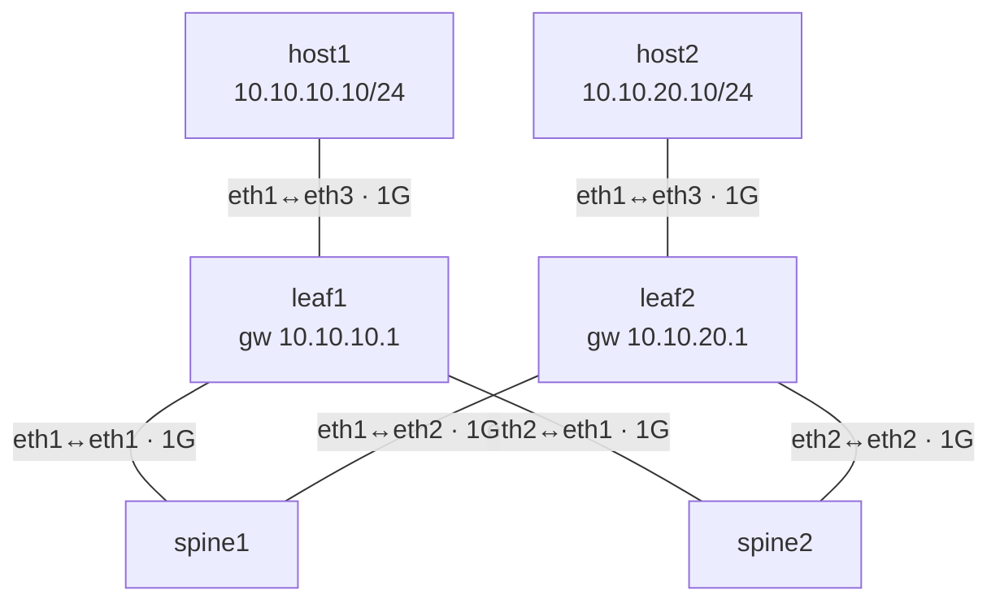

# Lab 59 — Capacity & MTU Planning

> **Format:** Reference + calculation exercises. Quantitative planning is the actual focus; the lab provides a fabric for verifying assumptions.
>
> **Story chapter:** Phase 9 · Tech lead · Year 5+. After two near-miss saturation incidents and one painful "why are jumbo pings failing on the new fabric" investigation, you write the planning guide. Bandwidth math, MTU end-to-end, oversubscription ratios — the unglamorous numbers that decide whether the fabric works at scale. See [`STORY.md`](../../STORY.md).

## Real-world scenario

Two situations the playbook addresses:

**Situation A — Capacity:** Marketing wants to add a new customer running 5 Gbps of inbound traffic. Your fabric "should" handle it; you "think" your spines have capacity. But you've never actually counted. Senior leadership asks: "if we onboard this customer, what's our risk?"

**Situation B — MTU:** A new customer reports their large-file transfers fail. Small pings work. You investigate. Somewhere on the path, MTU is wrong. Whose responsibility is it to know?

Both situations are solved by *doing the math first*.

## Goal

- Compute oversubscription ratio for a Clos fabric
- Compute end-to-end MTU budget including overheads (VXLAN, IPsec, etc.)
- Apply the planning workflow to extension decisions

## Topology

A small 2-spine / 2-leaf Clos with one host hung off each leaf. Every link is
*assumed* to be 1 Gbps for the capacity math (see the note under "Your task" — the
container links are not actually rate-limited).



Underlay addressing (in the reference solution): leaf↔spine point-to-point /31s out
of `10.0.0.0/24`, OSPF area 0 everywhere; host1 in `10.10.10.0/24` (gateway
`10.10.10.1` on leaf1 `eth3`), host2 in `10.10.20.0/24` (gateway `10.10.20.1` on
leaf2 `eth3`). The shipped `configs/` are minimal starters (hostname only) — the
working path lives in `solutions/`.

## Theory primer

### Oversubscription

```
N_leaf_ports_to_servers × server_link_speed       (south)
─────────────────────────────────────────────  =  oversubscription ratio
N_leaf_ports_to_spines × spine_link_speed         (north)
```

Example: 48× 10G server ports + 4× 100G uplinks per leaf.

```
48 × 10 Gbps = 480 Gbps  south
 4 × 100 Gbps = 400 Gbps  north

ratio = 480/400 = 1.2:1
```

Industry rules of thumb:
- **1:1** (non-blocking) — required for HPC, AI training, storage backbone
- **2:1 - 3:1** — typical for general cloud workloads
- **5:1+** — only OK if you know workload averages
- **10:1+** — campus/office; assumes most servers idle

Add up the *actual* worst-case demand across your customers. If it exceeds the north bandwidth, you have a capacity problem before the link counter shows it.

### Capacity planning workflow

1. **Inventory all customer/tenant peaks** (NetBox-tagged, or from Prom metrics)
2. **Compute simultaneous-worst-case demand** (not always sum-of-peaks; correlate)
3. **Compare to fabric north bandwidth per leaf**
4. **Compare to inter-pod bandwidth**
5. **Compare to external/transit bandwidth**
6. **Identify the bottleneck** (the smallest of the above)
7. **Plan expansion before utilization hits 70%** (rule of thumb)

70% is the planning threshold because:
- ECMP hash imbalance can push the busiest link 30% above average
- A single device failure means remaining devices absorb its share
- Lead time to add capacity is weeks to months

### MTU math

For a payload to travel end-to-end without fragmentation, every link in the path must support the largest frame size used.

Stack overheads (add to your payload):

| Layer | Overhead bytes |
|---|---|
| Ethernet header + FCS | 18 (14 + 4) |
| 802.1Q VLAN tag | +4 |
| QinQ (S-tag + C-tag) | +8 |
| IP header (v4) | 20 |
| TCP header | 20 |
| UDP header | 8 |
| VXLAN | 50 (8 VXLAN + 8 UDP + 20 outer IPv4 + 14 outer Ethernet = 50 bytes added on top of the inner frame) |
| GRE | 24 (4 GRE + 20 outer IP) |
| IPsec ESP tunnel mode | ~50-90 (varies with crypto) |
| WireGuard | 60 |
| MPLS label | +4 per label |

Example: ethernet payload over VXLAN over a normal IP fabric:
- Tenant frame: 1500 bytes (standard MTU)
- After VXLAN encap: 1500 + 50 = **1550 bytes** on the underlay
- → Underlay MUST support MTU 1550 (typically you set 9000 to leave headroom)

### Path MTU Discovery and where it breaks

ICMP "Frag Needed" (type 3 code 4) is the message that tells a sender to back off. If any device on the path blocks ICMP (firewall), PMTUD silently breaks — connections to that destination hang on large transfers but work on small ones.

Fixing this requires identifying the blocker and reopening ICMP. Don't blanket-block ICMP at firewalls; allow at least type 3.

### Jumbo frame deployment checklist

To roll out MTU 9000 in a fabric:
1. Confirm all *physical* links support it (some old switches cap at 9216)
2. Set MTU 9214 on every device-to-device link (Arista convention)
3. Set MTU 9000 on host-facing access ports (or 9214 if hosts also use jumbo)
4. **Test end-to-end**: `ping -M do -s 8972 dest` from every endpoint
5. Roll out per-fabric, not all at once
6. Monitor: any drops with "MTU mismatch" log lines

A common partial deployment: jumbo set on switches but not on one customer's NIC. That customer's TCP traffic works (PMTUD), UDP-heavy traffic gets dropped. Hard to spot; verify endpoint MTU separately.

### Bandwidth modeling for a planned change

When adding a new service:

```
expected_throughput   = (target QPS) × (bytes per request)
+ overhead for retries, headers, etc.   ~20%
+ peak factor (peak/average)            ~3× for typical web,
                                          ~1.5× for storage
= planned bandwidth

Compare to:
- per-server NIC capacity (>2× planned)
- per-leaf north capacity (planned + existing < 70% of leaf's spine bandwidth)
- per-spine capacity (sum across leaves < 70% of spine total)
- transit capacity (if egress-heavy)
```

If any of those fail, plan expansion first.

## Your task

The "task" here is computational, not configurational:

> **Lab limitation — the "1G links" are a paper assumption.** containerlab veth
> links are **not** rate-limited; they run at host speed. So "1G links throughout"
> is purely an assumption for the math — the container fabric cannot enforce a 1G
> ceiling and you will **not** be able to observe congestion or saturation here.
> The exercise is the *calculation*, not a load test. (The MTU portion below
> *is* directly observable, because the default interface MTU really is 1500.)

1. Given the lab topology (2 spines, 2 leaves, 1G links throughout), compute:
   - Oversubscription ratio per leaf
   - Maximum tenant-to-tenant bisection bandwidth (single direction)
   - Same with one spine failed
2. Plan a hypothetical customer: 800 Mbps sustained + 1.5× peak factor. Will the fabric handle:
   - One such customer? Two? Five?
   - Where's the first bottleneck?
3. MTU exercise: a customer wants jumbo on their stretched VLAN (VXLAN-extended across DCs). Their VMs use MTU 1500. What's the *underlay* MTU you need (and on the inter-DC link too)?

## Hints

This is a math/reference lab — the formulas you need are already in the Theory
primer. Pointers:

- **Oversubscription** = south (server-facing) bandwidth ÷ north (spine-facing)
  bandwidth per leaf. Count the lab's actual ports: 1 server port, 2 uplinks.
- **Bisection** between two leaves = number of usable spine paths × per-link speed.
  Cross out one spine for the failure case.
- **Bottleneck** = the *smallest* pipe on the path (access port → leaf-north →
  bisection). Walk the planned 1.2 Gbps (800 Mbps × 1.5) through each.
- **MTU** = inner frame + encapsulation overhead. Use the VXLAN row of the overhead
  table; remember the underlay *minimum* and the *convention* value (9214) are
  different numbers.

## Verification

The shipped `configs/` are hostname-only starters, so **out of the box there is no
forwarding path** between host1 and host2 — both pings below would fail for lack of
a route, not because of MTU. To make the MTU behaviour observable you first need a
working L3 path. The easiest way is to load the reference underlay (routed host
gateways `10.10.10.1`/`10.10.20.1` on each leaf `eth3`, /31s leaf↔spine, OSPF
area 0) — point the topology at `solutions/` and redeploy:

```bash
# temporarily build the fabric with the reference configs, then redeploy
sed 's#configs/#solutions/#' topology.clab.yml > topology.solution.yml
sudo containerlab deploy -t topology.solution.yml --reconfigure
```

Or paste each `solutions/<node>.cfg` into the device by hand
(`docker exec -it clab-capacity-mtu-planning-leaf1 Cli`, then `configure`).
Once OSPF has converged (`show ip route` on a leaf lists the far host subnet),
test MTU end-to-end:

```bash
# small ping fits inside the default 1500 MTU → succeeds
docker exec clab-capacity-mtu-planning-host1 ping -c2 -M do -s 1472 10.10.20.10
#   1472 payload + 8 ICMP + 20 IP = 1500 → goes through

# jumbo ping exceeds the default 1500 MTU → fails
docker exec clab-capacity-mtu-planning-host1 ping -c2 -M do -s 8972 10.10.20.10
#   8972 + 28 = 9000 → "Frag needed" / 100% loss, because every interface is MTU 1500
```

The first ping succeeds (path is up, frame fits). The second fails with a
fragmentation-needed error — that is the MTU lesson: a path with a 1500-byte link
silently kills full-size jumbo frames. To make the jumbo ping succeed you would set
`mtu 9214` on every leaf↔spine and leaf↔host interface and raise the host NIC MTU to
9000 — that is the jumbo-frame deployment checklist in action.

## Peek at solution

The whole deliverable of this lab is the *math*, so the reference answers live with
the worked numbers, not in device config alone:

- **Worked answers** for all three task items (oversubscription, bisection,
  one-spine-failed, the 800 Mbps × 1.5 customer scaling + first bottleneck, and the
  VXLAN underlay MTU): [`solutions/answers.md`](solutions/answers.md)
- **Reference underlay** that makes the Verification path real (OSPF, /31s, host
  gateways): [`solutions/leaf1.cfg`](solutions/leaf1.cfg),
  [`leaf2.cfg`](solutions/leaf2.cfg), [`spine1.cfg`](solutions/spine1.cfg),
  [`spine2.cfg`](solutions/spine2.cfg)

## What's missing (deliberately)

- **TCAM utilization planning** — distinct discipline; hardware-specific
- **Forwarding plane microburst analysis** — needs production telemetry
- **AI/ML workload modeling** — distinct patterns; needs domain knowledge
- **Cost/$$ modeling** — out of scope for technical curriculum
- **CDN / edge capacity** — covered conceptually in lab 39

## Cleanup

```bash
sudo containerlab destroy --cleanup
```
