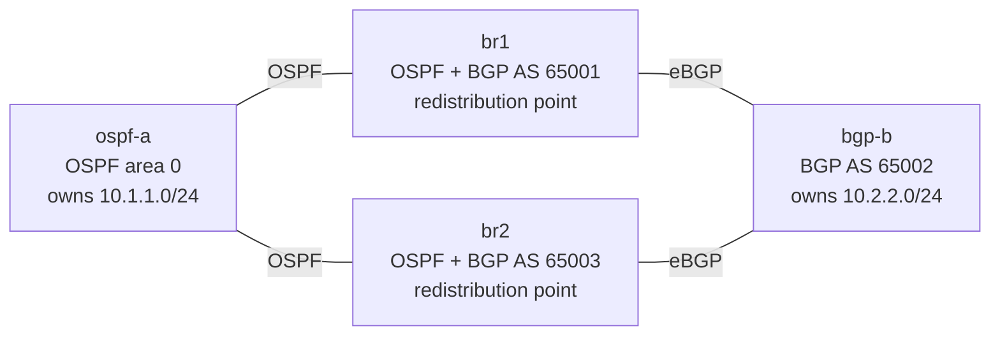

# Lab 60 — Route Redistribution & Loop Prevention (OSPF ↔ BGP)

> **Format:** Hands-on. Two routing domains, two border routers, mutual redistribution — your job is to stitch the domains together **without creating a routing loop**. Reference answer in [`solutions/`](solutions/).
>
> **Story chapter:** Bonus track — *Advanced Routing (CCIE-depth)* · Year 5+ · Tech lead. The 9-phase arc is behind you; this is the specialist depth you pick up while mentoring. The Company just **acquired a smaller competitor**, and their network runs **BGP at the edge** while yours is an **OSPF core**. The integration ticket lands on your desk: "make the two networks talk — and don't take anything down." See [`STORY.md`](../../STORY.md).

## Real-world scenario

The acquired company's routers speak BGP (AS 65002). Your core is OSPF. You drop in **two** border routers — `br1` and `br2` — for redundancy, each running OSPF on one side and eBGP on the other, and you redistribute routes between the two protocols so hosts on either side can reach each other.

The moment you turn up the **second** border, things get dangerous: a route learned from OSPF, redistributed into BGP by `br1`, travels across the BGP domain, and `br2` redistributes it **back into OSPF** — where it now looks like it came from BGP. That's a **redistribution feedback loop**: suboptimal paths, flapping, or full-blown loops. Crucially, BGP's own AS-path loop check **won't save you here** — the two borders are deliberately in different ASes (65001 / 65003), so the route doesn't carry a "seen this AS" marker on the way back.

The fix is the classic one every CCIE-level engineer must know cold: **mark routes with their origin domain, and refuse to re-inject a route into the domain it came from.**

## Goal

- Mutually redistribute **OSPF ↔ BGP** at two border routers so `ospf-a` (10.1.1.0/24) and `bgp-b` (10.2.2.0/24) reach each other.
- Do it **loop-free**: a route must never be redistributed back into the domain that originated it.
- Verify end-to-end reachability **and** that the loop is actually blocked.

## Topology



| Link | OSPF side | BGP side |
|------|-----------|----------|
| ospf-a:eth1 ↔ br1:eth1 | 10.0.13.1/30 · 10.0.13.2/30 | — |
| ospf-a:eth2 ↔ br2:eth1 | 10.0.14.1/30 · 10.0.14.2/30 | — |
| bgp-b:eth1 ↔ br1:eth2 | — | 10.0.23.2/30 · 10.0.23.1/30 |
| bgp-b:eth2 ↔ br2:eth2 | — | 10.0.24.2/30 · 10.0.24.1/30 |

ASNs: `bgp-b` = **65002**, `br1` = **65001**, `br2` = **65003** (different border ASes on purpose). The two "customer" prefixes are `10.1.1.0/24` (OSPF, on ospf-a's Loopback1) and `10.2.2.0/24` (BGP, on bgp-b's Loopback1).

## Theory primer

### What redistribution is — and why two points is a trap

Redistribution copies routes from one routing protocol's table into another's. With a **single** border it's harmless. With **two** (which you need for redundancy), each border is a door *in both directions*, and a route can walk OUT of a domain through one door and back IN through the other:

```
10.1.1.0/24 (OSPF)  --br1 redistribute-->  BGP  --br2 redistribute-->  OSPF (again!)
```

Now OSPF has two sources for 10.1.1.0/24: the real one (intra-area, from ospf-a) and a fake "external" one (from br2). Depending on administrative distance and metrics, routers may believe the fake one — black-holing traffic or looping it between the borders.

### The two tools that stop it

EOS gives each protocol a way to *mark* a route as it leaves, and *match* that mark on the way back:

- **OSPF** carries a **route tag** (a 32-bit number) on external (redistributed) routes.
- **BGP** carries **communities** (`ASN:value`).

So the recipe is: **tag/community on the way OUT, deny that mark on the way IN.**
- OSPF → BGP: set community `65000:1` ("this came from OSPF"). On BGP → OSPF, **deny** anything with `65000:1`.
- BGP → OSPF: set tag `2` ("this came from BGP"). On OSPF → BGP, **deny** anything with tag `2`.

Because both borders apply the *same* marks, a route br1 pushes into BGP carries `65000:1`, and when br2 sees it, br2 refuses to push it back into OSPF. Loop broken.

### Why not just rely on administrative distance?

AD tuning (making the redistributed route less believable than the native one) is a *second* line of defence and sometimes the right tool, but it's fragile across many prefixes and doesn't stop the route from *propagating* — it just changes which copy wins locally. Tag/community filtering stops the bad route at the source. Real designs often use both; this lab teaches the filtering, which is the robust one.

## Your task

On **both** `br1` and `br2`:

1. Redistribute **BGP into OSPF** and **OSPF into BGP**.
2. Build the loop-prevention marks:
   - Mark OSPF-origin routes with BGP community `65000:1` when they enter BGP; **drop** community-`65000:1` routes when going back into OSPF.
   - Mark BGP-origin routes with OSPF tag `2` when they enter OSPF; **drop** tag-`2` routes when going back into BGP.
3. Keep `send-community` on the eBGP sessions (so the community survives br1 → bgp-b → br2).

Goal state: `ospf-a` can ping `10.2.2.2`, `bgp-b` can ping `10.1.1.1`, and **neither border re-injects the other domain's prefix** (e.g. br2 still sees `10.1.1.0/24` as a normal OSPF intra-area route, never as `O E2`).

## Hints

- Community list: `ip community-list <NAME> permit 65000:1`.
- Route-map skeleton (a `deny` clause to drop the marked route, then a `permit` clause to mark the rest):
  ```
  route-map OSPF-TO-BGP deny 10
     match tag 2
  route-map OSPF-TO-BGP permit 20
     set community 65000:1
  ```
- Apply the maps **on redistribution**, not on the neighbor:
  ```
  router ospf 1
     redistribute bgp route-map BGP-TO-OSPF
  router bgp <asn>
     redistribute ospf route-map OSPF-TO-BGP
  ```
- `set tag <n>` (in a route-map used for `redistribute bgp`) writes the OSPF external-route tag; `match tag <n>` / `match community <list>` read it back.
- Don't forget `neighbor <ip> send-community` (already in the starter) — without it the `65000:1` mark never reaches the far border.

## Verification

Deploy the starters, then build your redistribution on br1 and br2.

```bash
cd ~/containerlab/labs/60-route-redistribution
sudo containerlab deploy
```

1. **OSPF→BGP carries the community** — on `bgp-b`:
   ```
   show ip bgp 10.1.1.0/24
   ```
   You should see `10.1.1.0/24` from **both** borders (10.0.23.1 and 10.0.24.1), each tagged `Community: 65000:1`.

2. **BGP→OSPF is external + tagged** — on `ospf-a`:
   ```
   show ip route 10.2.2.0/24
   ```
   → `O E2 10.2.2.0/24` (an OSPF external route). `show ip route 10.2.2.0/24 detail` shows tag 2.

3. **End-to-end** — from each side:
   ```
   docker exec clab-route-redistribution-ospf-a Cli -c "enable" -c "ping 10.2.2.2 source 10.1.1.1"
   docker exec clab-route-redistribution-bgp-b  Cli -c "enable" -c "ping 10.1.1.1 source 10.2.2.2"
   ```
   Both should be **0% loss**. (The `enable` is required — extended `ping ... source ...` is a privileged command.)

4. **The loop is blocked** — on `br2`:
   ```
   show ip route 10.1.1.0/24
   ```
   It must be `O 10.1.1.0/24` (a normal OSPF **intra-area** route learned straight from ospf-a) — **not** `O E2` (which would mean br2 re-learned its own domain's prefix back through BGP). If you remove the community filter, watch this flip to `O E2` and the design start to wobble.

## Peek at solution

Full configs in [`solutions/`](solutions/) — `br1.cfg` / `br2.cfg` carry the community-list, the two route-maps, and the `redistribute` statements; `ospf-a.cfg` / `bgp-b.cfg` are unchanged from the starters. Validated end-to-end on live cEOS 4.35.4M (0% loss both directions, loop confirmed blocked).

## Concept reinforcement

- **Mutual redistribution at ≥2 points always risks a loop** — the number of redistribution points, not the protocols, is what makes it dangerous.
- **Tag (IGP) + community (BGP) are the same idea**: stamp the origin, refuse the return. Internalise the pattern, not the specific knobs.
- **BGP's AS-path is not a redistribution safety net** when borders are in different ASes (or when the route never carries the relevant AS).
- **EOS gotcha (found live):** under `router isis … / address-family ipv4 unicast`, `redistribute ospf` silently resolves to `redistribute ospfv3` (the IPv6 process) and so won't carry IPv4 OSPFv2 routes — which is why this lab uses OSPF ↔ **BGP** rather than OSPF ↔ IS-IS. The redistribution *concept* is identical.

## Cleanup

```bash
sudo containerlab destroy --cleanup
```
