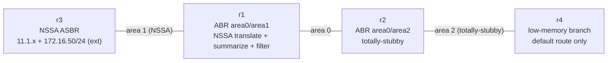

# Lab 61 — Advanced OSPF: NSSA, Totally-Stubby, Summarization & Filtering

> **Format:** Hands-on. A multi-area OSPF domain where each area is engineered for a different reason — shrink an edge router's LSDB, control externals from an acquired network, and keep the backbone tidy. Reference answer in [`solutions/`](solutions/).
>
> **Story chapter:** Bonus track — *Advanced Routing (CCIE-depth)* · Year 5+ · Tech lead. Your OSPF estate has grown past "just make it converge." Now you're *engineering areas*: a small branch router is drowning in LSAs, and the network you [acquired in lab 60](../60-route-redistribution/) injects external routes you must summarize and filter before they pollute the core. See [`STORY.md`](../../STORY.md).

## Real-world scenario

Three things land on you at once:

1. **A branch on an old, low-memory router (`r4`)** keeps flapping under LSDB pressure. It doesn't need the full topology — it has exactly one way out. You convert its area to **totally-stubby** so it learns nothing but a default route.
2. **The acquired company's edge box (`r3`)** has to inject a handful of external routes (a redistributed `172.16.50.0/24`). But its area can't be a plain stub (stubs forbid externals) and you don't want to make the *whole* OSPF domain carry those Type-5s. The answer is an **NSSA** — a stub area that still allows *local* externals as Type-7, which the ABR translates to Type-5 for everyone else.
3. **That same edge box advertises a pile of internal `11.1.x` loopbacks** plus one prefix (`11.9.99.0/24`) that must never leave its area. You **summarize** the `11.1.x` routes into one `11.1.0.0/16` at the ABR and **filter** `11.9.99.0/24` entirely.

> **Note — no virtual links:** the classic 4th advanced-OSPF tool, the *virtual link* (repairing a discontiguous backbone through a transit area), is **not supported on cEOS** (`area … virtual-link …` returns `% Invalid input`). It's described in the theory below for completeness; the lab itself uses the three features cEOS does support.

## Goal

- **Area 1 → NSSA**: `r3` redistributes a static as a **Type-7**; `r1` (ABR) translates it to a **Type-5** so the rest of the domain sees `172.16.50.0/24` as `O E2`.
- **Area 1 summarization + filtering** on `r1`: collapse `11.1.10/24` + `11.1.20/24` into `11.1.0.0/16`, and suppress `11.9.99.0/24` completely.
- **Area 2 → totally-stubby**: `r4` ends up with **only** a default route.

## Topology



| Link | Subnet | Area |
|------|--------|------|
| r1:eth1 ↔ r2:eth1 | 10.0.0.0/30 | 0 (backbone) |
| r1:eth2 ↔ r3:eth1 | 10.1.0.0/30 | 1 (NSSA) |
| r2:eth2 ↔ r4:eth1 | 10.2.0.0/30 | 2 (totally-stubby) |

`r3` owns the `11.1.10.0/24`, `11.1.20.0/24`, `11.9.99.0/24` loopbacks (in area 1) and a static `172.16.50.0/24 → Null0` (the "external"). Router-IDs are `1.1.1.1`–`4.4.4.4`.

## Theory primer

### OSPF area types — what each one blocks

An area type is a deal: give up some LSA detail, get a smaller LSDB.

| Area type | Type-3 (inter-area) | Type-5 (external) | Type-7 (NSSA external) |
|-----------|:---:|:---:|:---:|
| Normal | ✅ | ✅ | — |
| **Stub** | ✅ | ❌ (default instead) | ❌ |
| **Totally-stubby** | ❌ (default only) | ❌ | ❌ |
| **NSSA** | ✅ | ❌ | ✅ (locally) |
| **Totally-NSSA** | ❌ (default only) | ❌ | ✅ (locally) |

- A **stub** can't carry externals — so it can't contain an ASBR. The ABR injects a default in place of all the Type-5s.
- **Totally-stubby** (`stub no-summary` on the **ABR**) goes further and also drops inter-area Type-3s: the area sees *only* a default. Perfect for a leaf site with one exit.
- An **NSSA** is the escape hatch: "I need an ASBR *inside* a stubby area." Local redistribution becomes **Type-7** (allowed where Type-5 isn't); the ABR **translates** Type-7 → Type-5 outbound. Plain Type-5s from elsewhere still can't enter.

### Summarization vs filtering (both at the ABR)

- `area <id> range <prefix>` — advertise one summary Type-3 for all intra-area routes inside `<prefix>`, hiding the specifics. Fewer LSAs, more stable (a flapping /24 inside the summary doesn't ripple out).
- `area <id> range <prefix> not-advertise` — the opposite: suppress that block entirely. Nothing in `<prefix>` leaves the area.

### Virtual links (concept only here)

If a non-backbone area gets physically cut off from area 0 (or area 0 itself becomes discontiguous), a **virtual link** tunnels OSPF across a *transit* area to restore backbone connectivity: `area <transit> virtual-link <remote-RID>`. It's a repair tool, not a design goal — and **cEOS doesn't implement it**, so we only describe it.

## Your task

The starters bring up a normal 3-area OSPF (all adjacencies Full, every route visible everywhere). Engineer the areas:

1. **r3 + r1**: make area 1 an **NSSA** (both routers — all routers in an area must agree on its type). On `r3`, `redistribute static` so `172.16.50.0/24` enters as a Type-7.
2. **r1**: summarize area 1's internals with `area 1 range 11.1.0.0/16`, and filter `11.9.99.0/24` with `area 1 range 11.9.99.0/24 not-advertise`.
3. **r2 + r4**: make area 2 **totally-stubby** — `area 2 stub no-summary` on the ABR `r2`, `area 2 stub` on `r4`.

## Hints

- Area type is set under `router ospf`, per area: `area 0.0.0.1 nssa`, `area 0.0.0.2 stub no-summary` (ABR) / `area 0.0.0.2 stub` (internal router).
- `redistribute static` on the NSSA ASBR produces Type-7; the ABR translates automatically (no extra command needed for basic translation).
- `area <id> range <prefix>` summarizes; add `not-advertise` to suppress instead.
- All routers in an area must agree on the type, or the adjacency won't form (watch `show ip ospf neighbor`).

## Verification

```bash
cd ~/containerlab/labs/61-advanced-ospf
sudo containerlab deploy
```

1. **Adjacencies** — on `r1`: `show ip ospf neighbor` → two `FULL` (r2, r3).

2. **NSSA + summarization + filtering** — on `r2`:
   ```
   show ip route ospf
   ```
   - `O IA 11.1.0.0/16` — the **summary** (you should NOT see `11.1.10.0/24` / `11.1.20.0/24` individually).
   - **No `11.9.99.0/24`** anywhere — filtered.
   - `O E2 172.16.50.0/24` — the NSSA Type-7, translated to a Type-5 by `r1`.

3. **NSSA internals** — on `r3`:
   ```
   show ip ospf                       ! "It is a NSSA area"
   show ip ospf database nssa-external ! the Type-7 for 172.16.50.0/24
   ```

4. **Totally-stubby** — on `r4`:
   ```
   show ip route ospf
   ```
   You should see **only** `O IA 0.0.0.0/0` (the default) — no `11.1.x`, no `172.16.50.0/24`, no per-prefix inter-area routes. That's the whole point: a tiny LSDB.

## Peek at solution

[`solutions/`](solutions/) — `r1.cfg` carries the NSSA + `area range` (summary) + `area range … not-advertise` (filter); `r3.cfg` the NSSA + `redistribute static`; `r2.cfg`/`r4.cfg` the stub/totally-stubby. Validated on live cEOS 4.35.4M (summary, filter, Type-7→Type-5 translation, and default-only stub all confirmed).

## Concept reinforcement

- **Pick the most restrictive area type the site can tolerate** — totally-stubby for a single-exit leaf, NSSA when a stubby area still needs an ASBR.
- **Type-7 exists for exactly one reason**: to let an NSSA carry *local* externals without opening the door to *all* externals.
- **Summarize at boundaries** (ABR/ASBR) to cut LSA count and dampen flaps; **filter** with `not-advertise` when a prefix must stay put.
- **Virtual links are a repair, not a design** — and not available on cEOS; design a contiguous backbone instead.

## Cleanup

```bash
sudo containerlab destroy --cleanup
```
